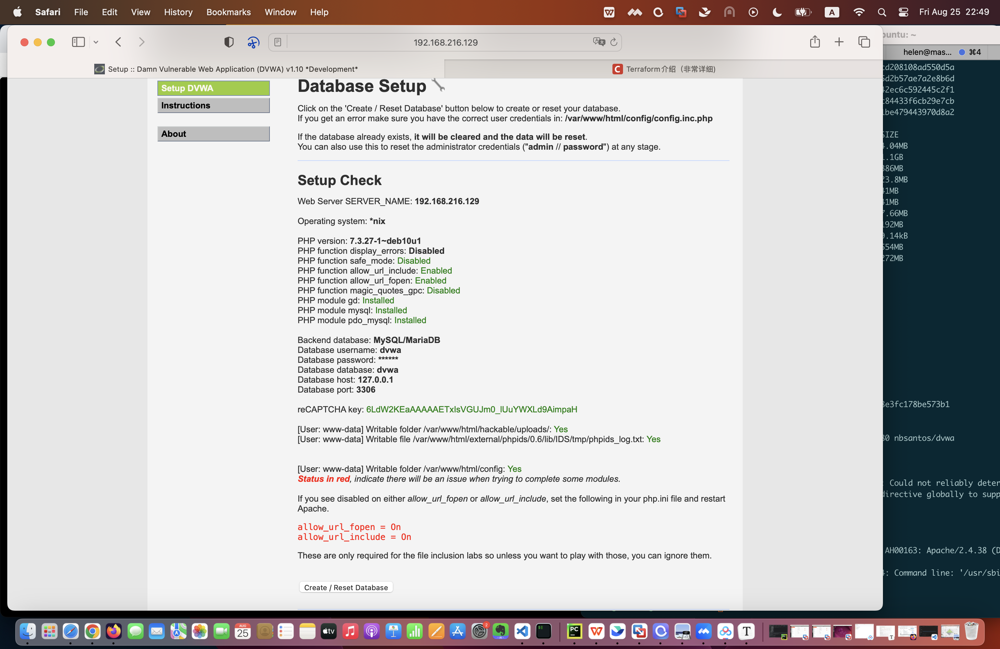
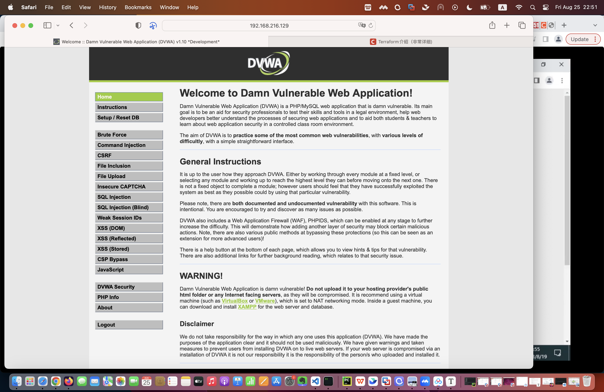
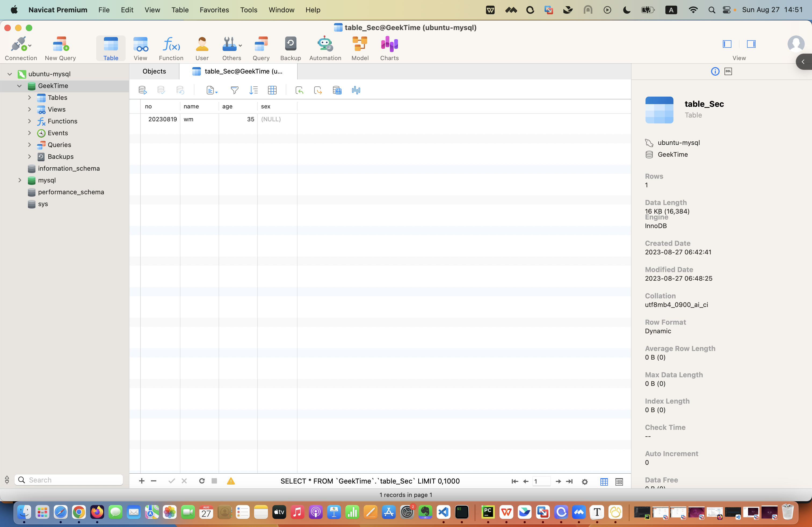

1. 在 Docker 中分别以后台方式和交互方式启动 CentOS，对比启动后的容器状态，实现退出容器也能保持其运行状态。

```shell
minwang@minwang-vm-ubuntu:~$ docker images
REPOSITORY             TAG       IMAGE ID       CREATED         SIZE
busybox                latest    fc9db2894f4e   5 weeks ago     4.04MB
kicbase/stable         v0.0.40   f52519afe5f6   6 weeks ago     1.1GB
mariadb                10        5fc7fccd2af9   7 weeks ago     386MB
registry               latest    daace2c8ce4c   2 months ago    23.8MB
nginx                  alpine    66bf2c914bf4   2 months ago    41MB
127.0.0.1:5000/nginx   alpine    66bf2c914bf4   2 months ago    41MB
alpine                 latest    5053b247d78b   2 months ago    7.66MB
nginx                  latest    2d21d843073b   2 months ago    192MB
hello-world            latest    b038788ddb22   3 months ago    9.14kB
wordpress              5         4e46e98a2e06   15 months ago   554MB
centos                 latest    e6a0117ec169   23 months ago   272MB

minwang@minwang-vm-ubuntu:~$ docker run -d centos  #后台方式启动centos
c930bbcdbbbcac6e0dcfb102fdded8a0b08f9b5231875a80311a3a80980e1fd3
minwang@minwang-vm-ubuntu:~$ docker ps -a
CONTAINER ID   IMAGE                    COMMAND                  CREATED              STATUS                          PORTS                                                                                                                                  NAMES
c930bbcdbbbc   centos                   "/bin/bash"              About a minute ago   Exited (0) About a minute ago                                                                                                                                          festive_vaughan
b6f0cab14fb7   nginx:alpine             "/docker-entrypoint.…"   2 weeks ago          Up 2 weeks                                                                                                                                                             busy_morse
ad9a919e617e   kicbase/stable:v0.0.40   "/usr/local/bin/entr…"   2 weeks ago          Up 2 weeks                      127.0.0.1:32772->22/tcp, 127.0.0.1:32771->2376/tcp, 127.0.0.1:32770->5000/tcp, 127.0.0.1:32769->8443/tcp, 127.0.0.1:32768->32443/tcp   minikube
c35332ea4d29   registry                 "/entrypoint.sh /etc…"   2 weeks ago          Up 2 weeks                      0.0.0.0:5000->5000/tcp, :::5000->5000/tcp                                                                                              priceless_pare
c7c75fac280a   alpine                   "sh"                     3 weeks ago          Exited (0) 3 weeks ago                                                                                                                                                 dazzling_archimedes
b14aa69f1961   busybox                  "echo hello world"       3 weeks ago          Exited (0) 3 weeks ago                                                                                                                                                 hungry_chaum
eaad84693c7f   nginx                    "/docker-entrypoint.…"   8 weeks ago          Exited (0) 3 weeks ago                                                                                                                                                 agitated_swartz
c92ce89cc1eb   nginx                    "/docker-entrypoint.…"   8 weeks ago          Exited (0) 3 weeks ago                                                                                                                                                 jovial_lovelace
c3dba03f31ff   centos                   "bash"                   8 weeks ago          Exited (0) 8 weeks ago                                                                                                                                                 mystifying_pike
cfa89acf331e   hello-world              "/hello"                 8 weeks ago          Exited (0) 8 weeks ago

minwang@minwang-vm-ubuntu:~$ docker run -it centos /bin/bash  #交互方式启动centos
[root@ef1c7b8dad2b /]# ls -al
total 56
drwxr-xr-x   1 root root 4096 Aug 25 07:59 .
drwxr-xr-x   1 root root 4096 Aug 25 07:59 ..
-rwxr-xr-x   1 root root    0 Aug 25 07:59 .dockerenv
lrwxrwxrwx   1 root root    7 Nov  3  2020 bin -> usr/bin
drwxr-xr-x   5 root root  360 Aug 25 07:59 dev
drwxr-xr-x   1 root root 4096 Aug 25 07:59 etc
drwxr-xr-x   2 root root 4096 Nov  3  2020 home
lrwxrwxrwx   1 root root    7 Nov  3  2020 lib -> usr/lib
lrwxrwxrwx   1 root root    9 Nov  3  2020 lib64 -> usr/lib64
drwx------   2 root root 4096 Sep 15  2021 lost+found
drwxr-xr-x   2 root root 4096 Nov  3  2020 media
drwxr-xr-x   2 root root 4096 Nov  3  2020 mnt
drwxr-xr-x   2 root root 4096 Nov  3  2020 opt
dr-xr-xr-x 465 root root    0 Aug 25 07:59 proc
dr-xr-x---   2 root root 4096 Sep 15  2021 root
drwxr-xr-x  11 root root 4096 Sep 15  2021 run
lrwxrwxrwx   1 root root    8 Nov  3  2020 sbin -> usr/sbin
drwxr-xr-x   2 root root 4096 Nov  3  2020 srv
dr-xr-xr-x  13 root root    0 Aug 25 07:59 sys
drwxrwxrwt   7 root root 4096 Sep 15  2021 tmp
drwxr-xr-x  12 root root 4096 Sep 15  2021 usr
drwxr-xr-x  20 root root 4096 Sep 15  2021 var
[root@ef1c7b8dad2b /]# minwang@minwang-vm-ubuntu:~$ docker ps
CONTAINER ID   IMAGE                    COMMAND                  CREATED              STATUS              PORTS                                                                                                                                  NAMES
ef1c7b8dad2b   centos                   "/bin/bash"              About a minute ago   Up About a minute                                                                                                                                          stoic_varahamihira
b6f0cab14fb7   nginx:alpine             "/docker-entrypoint.…"   2 weeks ago          Up 2 weeks                                                                                                                                                 busy_morse
ad9a919e617e   kicbase/stable:v0.0.40   "/usr/local/bin/entr…"   2 weeks ago          Up 2 weeks          127.0.0.1:32772->22/tcp, 127.0.0.1:32771->2376/tcp, 127.0.0.1:32770->5000/tcp, 127.0.0.1:32769->8443/tcp, 127.0.0.1:32768->32443/tcp   minikube
c35332ea4d29   registry                 "/entrypoint.sh /etc…"   2 weeks ago          Up 2 weeks          0.0.0.0:5000->5000/tcp, :::5000->5000/tcp                                                                                              priceless_pare
minwang@minwang-vm-ubuntu:~$
```


2. 在 Docker 中部署 DVWA，要求：DVWA Web 端口映射到 8081，提供访问截图。

```shell
minwang@minwang-vm-ubuntu:~$ docker pull nbsantos/dvwa
Using default tag: latest
latest: Pulling from nbsantos/dvwa
ef28e7e77ecb: Pull complete
a1b35453a850: Pull complete
68789387b082: Pull complete
2db6d3dceffa: Pull complete
af857dc3d448: Pull complete
4c6d9f586209: Pull complete
240a684ffb5b: Pull complete
773e941c3304: Pull complete
ec062824f95c: Pull complete
Digest: sha256:d996e5784be7f939686004a4f41c46219180dec6e1bb56ad48e3fc178be573b1
Status: Downloaded newer image for nbsantos/dvwa:latest
docker.io/nbsantos/dvwa:latest
minwang@minwang-vm-ubuntu:~$ docker run -it --name dvwa -p 8081:80 nbsantos/dvwa
[+] Starting mysql...
[ ok ] Starting MariaDB database server: mysqld ..
[+] Starting apache...
[....] Starting Apache httpd web server: apache2AH00558: apache2: Could not reliably determine the server's fully qualified domain name, using 172.17.0.2. Set the 'ServerName' directive globally to suppress this message
. ok
==> /var/log/apache2/access.log <==

==> /var/log/apache2/error.log <==
[Fri Aug 25 14:44:00.634472 2023] [mpm_prefork:notice] [pid 272] AH00163: Apache/2.4.38 (Debian) configured -- resuming normal operations
[Fri Aug 25 14:44:00.634713 2023] [core:notice] [pid 272] AH00094: Command line: '/usr/sbin/apache2'

==> /var/log/apache2/other_vhosts_access.log <==
```






3. MySQL 练习

- 创建一个名为 GeekTime 的数据库；
- 在 GeekTime 数据库中创建一张名为 table_Sec 的表，要求有序号、姓名、年龄、性别字段；
- 在 table_Sec 表中插入数据，序号是 20230819，姓名是拼音缩写，年龄、性别无要求 ;
- 使用 Navicat 连接你所创建的数据库，查看个人信息并提供截图。

```shell
minwang@minwang-vm-ubuntu:~$ docker pull mysql
Using default tag: latest
latest: Pulling from library/mysql
latest: Pulling from library/mysql
bd2ec1b01835: Pull complete
ec2e560d878c: Pull complete
e8397fbbbc3b: Pull complete
eff4258297ab: Pull complete
137be606bff3: Pull complete
0ef6a538fcba: Pull complete
a5431fa8c17d: Pull complete
23af94ba6338: Pull complete
87a8250fff28: Pull complete
6b7e1aea563b: Pull complete
Digest: sha256:c0455ac041844b5e65cd08571387fa5b50ab2a6179557fd938298cab13acf0dd
Status: Downloaded newer image for mysql:latest
docker.io/library/mysql:latest
minwang@minwang-vm-ubuntu:~$ docker run -p 3306:3306 --name mysql -e MYSQL_ROOT_PASSWORD=123456 -d mysql:latest
ebfc225dae5bead48ee264836ce99a2349f0b3a918d71c7fa3e966b93e3fa63e
minwang@minwang-vm-ubuntu:~$ docker ps -a
CONTAINER ID   IMAGE                    COMMAND                  CREATED         STATUS                      PORTS                                                  NAMES
ebfc225dae5b   mysql:latest             "docker-entrypoint.s…"   5 seconds ago   Up 4 seconds                0.0.0.0:3306->3306/tcp, :::3306->3306/tcp, 33060/tcp   mysql
ee3ab27d9ad8   nbsantos/dvwa            "/bin/sh -c /start.sh"   22 hours ago    Up 22 hours                 0.0.0.0:8081->80/tcp, :::8081->80/tcp                  dvwa
ef1c7b8dad2b   centos                   "/bin/bash"              29 hours ago    Exited (0) 26 hours ago                                                            stoic_varahamihira
ad9a919e617e   kicbase/stable:v0.0.40   "/usr/local/bin/entr…"   2 weeks ago     Exited (137) 26 hours ago                                                          minikube
c35332ea4d29   registry                 "/entrypoint.sh /etc…"   2 weeks ago     Exited (2) 26 hours ago                                                            priceless_pare
minwang@minwang-vm-ubuntu:~$ ip addr
1: lo: <LOOPBACK,UP,LOWER_UP> mtu 65536 qdisc noqueue state UNKNOWN group default qlen 1000
    link/loopback 00:00:00:00:00:00 brd 00:00:00:00:00:00
    inet 127.0.0.1/8 scope host lo
       valid_lft forever preferred_lft forever
    inet6 ::1/128 scope host
       valid_lft forever preferred_lft forever
2: ens160: <BROADCAST,MULTICAST,UP,LOWER_UP> mtu 1500 qdisc fq_codel state UP group default qlen 1000
    link/ether 00:0c:29:7f:7e:09 brd ff:ff:ff:ff:ff:ff
    altname enp2s0
    inet 192.168.216.129/24 brd 192.168.216.255 scope global dynamic noprefixroute ens160
       valid_lft 935sec preferred_lft 935sec
    inet6 fe80::8308:4b60:8efe:b5ed/64 scope link noprefixroute
       valid_lft forever preferred_lft forever
3: ens256: <NO-CARRIER,BROADCAST,MULTICAST,UP> mtu 1500 qdisc fq_codel state DOWN group default qlen 1000
    link/ether 00:0c:29:7f:7e:13 brd ff:ff:ff:ff:ff:ff
    altname enp26s0
4: docker0: <BROADCAST,MULTICAST,UP,LOWER_UP> mtu 1500 qdisc noqueue state UP group default
    link/ether 02:42:ad:d1:67:9d brd ff:ff:ff:ff:ff:ff
    inet 172.17.0.1/16 brd 172.17.255.255 scope global docker0
       valid_lft forever preferred_lft forever
    inet6 fe80::42:adff:fed1:679d/64 scope link
       valid_lft forever preferred_lft forever
```


```shell
minwang@minwang-vm-ubuntu:~$ docker exec -it ebfc225dae5b /bin/sh
sh-4.4# mysql -uroot -p
Enter password:
Welcome to the MySQL monitor.  Commands end with ; or \g.
Your MySQL connection id is 9
Server version: 8.1.0 MySQL Community Server - GPL

Copyright (c) 2000, 2023, Oracle and/or its affiliates.

Oracle is a registered trademark of Oracle Corporation and/or its
affiliates. Other names may be trademarks of their respective
owners.

Type 'help;' or '\h' for help. Type '\c' to clear the current input statement.

mysql> show databases;
+--------------------+
| Database           |
+--------------------+
| information_schema |
| mysql              |
| performance_schema |
| sys                |
+--------------------+
4 rows in set (0.01 sec)

mysql> create database GeekTime;
Query OK, 1 row affected (0.03 sec)

mysql> show databases;
+--------------------+
| Database           |
+--------------------+
| GeekTime           |
| information_schema |
| mysql              |
| performance_schema |
| sys                |
+--------------------+
5 rows in set (0.01 sec)

mysql> use GeekTime;
Database changed

mysql> create table table_Sec(
    -> no int(16),
    -> name varchar(5),
    -> age int(3),
    -> sex char(1)
    -> );
Query OK, 0 rows affected, 2 warnings (0.05 sec)

mysql> show tables;
+--------------------+
| Tables_in_GeekTime |
+--------------------+
| table_Sec          |
+--------------------+
1 row in set (0.01 sec)

mysql> select * from table_Sec;
Empty set (0.04 sec)

mysql> desc table_Sec;
+-------+------------+------+-----+---------+-------+
| Field | Type       | Null | Key | Default | Extra |
+-------+------------+------+-----+---------+-------+
| no    | int        | YES  |     | NULL    |       |
| name  | varchar(5) | YES  |     | NULL    |       |
| age   | int        | YES  |     | NULL    |       |
| sex   | char(1)    | YES  |     | NULL    |       |
+-------+------------+------+-----+---------+-------+
4 rows in set (0.01 sec)

mysql> insert into table_Sec values(20230819, 'wm', 35, null);
Query OK, 1 row affected (0.04 sec)

mysql> select * from table_Sec;
+----------+------+------+------+
| no       | name | age  | sex  |
+----------+------+------+------+
| 20230819 | wm   |   35 | NULL |
+----------+------+------+------+
1 row in set (0.01 sec)

mysql>
```


