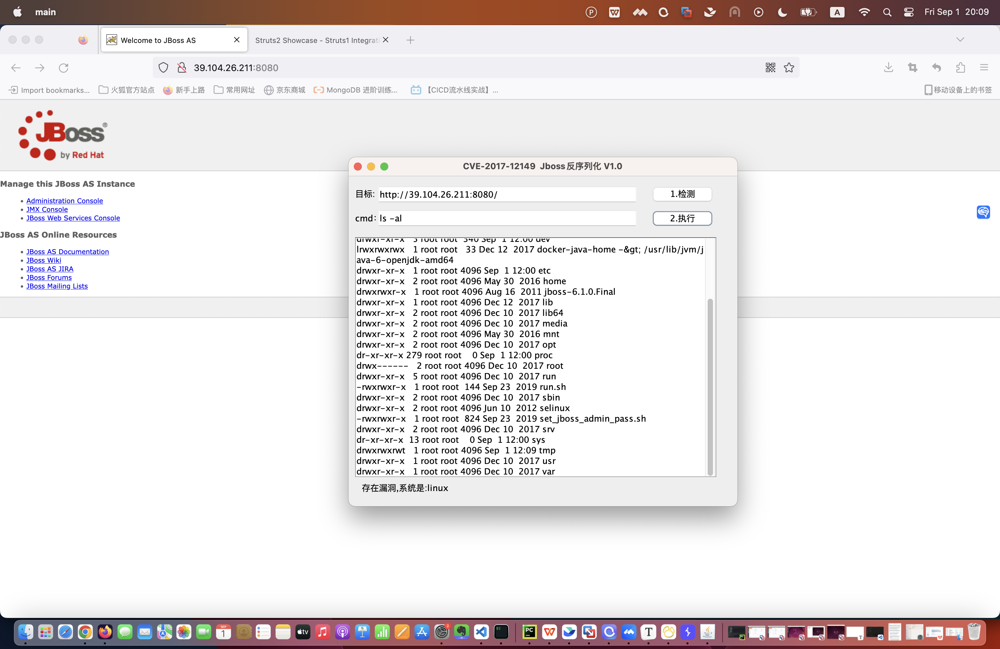

1. 练习 Tomcat PUT 方法任意写文件漏洞（CVE-2017-12615），提供命令执行截图。

```shell

root@master:~# docker pull cved/cve-2017-12615
Using default tag: latest
latest: Pulling from cved/cve-2017-12615
06b22ddb1913: Pull complete
336c28b408ed: Pull complete
1f3e6b8d80c3: Pull complete
aeac59510475: Pull complete
b01db8bd8540: Pull complete
f7f398af5fea: Pull complete
1c5595fa1317: Pull complete
e1a6cc83dc3d: Pull complete
9efe1c932022: Pull complete
eef936b7f842: Pull complete
3c1e71063aec: Pull complete
6da77f89f1ef: Pull complete
15aded192f27: Pull complete
77e0b7526f29: Pull complete
Digest: sha256:534231c78beffc997cc71cb679948a81227c7090c6e7eaee7025ac9a327bc7b4
Status: Downloaded newer image for cved/cve-2017-12615:latest
docker.io/cved/cve-2017-12615:latest
root@master:~# docker run -d -p 8080:8080 cved/cve-2017-12615
f62ca07546ec9999998a80da3e93041f5180cfa460fac2f61f02fbfdc5ff6577
root@master:~# docker ps
CONTAINER ID   IMAGE                 COMMAND             CREATED         STATUS         PORTS                                       NAMES
f62ca07546ec   cved/cve-2017-12615   "catalina.sh run"   5 seconds ago   Up 3 seconds   0.0.0.0:8080->8080/tcp, :::8080->8080/tcp   interesting_pike
```


2. 练习 S2-048 远程代码执行漏洞（CVE-2017-9791），提供命令执行截图。

```shell
root@master:~# docker search s2-048
NAME                                       DESCRIPTION                                     STARS     OFFICIAL   AUTOMATED
piesecurity/apache-struts2-cve-2017-5638   A simple container running a vulnerable Apac…   8                    [OK]
gjpt1/s2-048                                                                               0
securitytrain/s2-048                                                                       0
r0b3rt1/s2-048_struts2                                                                     0
jjogal/cve-2017-9791_exploitation_lab      Exploitation lab for APACHE STRUTS2 S2-048 (…   0
root@master:~# docker pull piesecurity/apache-struts2-cve-2017-5638
Using default tag: latest
latest: Pulling from piesecurity/apache-struts2-cve-2017-5638
9f0706ba7422: Pull complete
d3942a742d22: Pull complete
2b95a7bc6bf9: Pull complete
e4c7597bbbc1: Pull complete
5f5ed4ce77dc: Pull complete
63038208f189: Pull complete
1138b1f02201: Pull complete
f027013454f1: Pull complete
41cf8eaed89c: Pull complete
08038cdd003c: Pull complete
d4afc280bba7: Pull complete
a0416d3a601b: Pull complete
53046b5dd8b7: Pull complete
4cd5bcee33b9: Pull complete
Digest: sha256:381a90208031e7910555c99e7a88183389f5d159dcd118c2b98fd8ce196ab79e
Status: Downloaded newer image for piesecurity/apache-struts2-cve-2017-5638:latest
docker.io/piesecurity/apache-struts2-cve-2017-5638:latest
root@master:~# docker run -d -p 8081:8080 piesecurity/apache-struts2-cve-2017-5638
8ecac384e4615e96cded126eca6810ca7a5b2a00476a80494185bb6a200cc753
root@master:~# docker ps
CONTAINER ID   IMAGE                                      COMMAND             CREATED             STATUS             PORTS                                       NAMES
8ecac384e461   piesecurity/apache-struts2-cve-2017-5638   "catalina.sh run"   38 seconds ago      Up 37 seconds      0.0.0.0:8081->8080/tcp, :::8081->8080/tcp   blissful_pike
f62ca07546ec   cved/cve-2017-12615                        "catalina.sh run"   About an hour ago   Up About an hour   0.0.0.0:8080->8080/tcp, :::8080->8080/tcp   interesting_pike
```


3. 练习 JBoss 5.x/6.x 反序列化漏洞（CVE-2017-12149），提供命令执行截图。

```shell
root@master:~# docker search CVE-2017-12149
NAME                        DESCRIPTION   STARS     OFFICIAL   AUTOMATED
hackingpub/cve-2017-12149                 0
r0b3rt1/cve-2017-12149                    0
root@master:~# docker pull hackingpub/cve-2017-12149
Using default tag: latest
latest: Pulling from hackingpub/cve-2017-12149
762ae076e9a3: Pull complete
23de19d3f13a: Pull complete
88eb6f7cbbff: Pull complete
4a068071674d: Pull complete
b9eee10f8e2e: Pull complete
a53360b376d7: Pull complete
36f66cf89d4e: Pull complete
bbe64581d885: Pull complete
a5f9b940133c: Pull complete
567a8978e415: Pull complete
e58cfe1eedfe: Pull complete
57cf9bf5a3ec: Pull complete
792aaeb4bdcb: Pull complete
bb266d48c965: Pull complete
Digest: sha256:115c0b9def99465f9f2f838e9fef52450bca5db4b2e643f422a3879b69edfc66
Status: Downloaded newer image for hackingpub/cve-2017-12149:latest
docker.io/hackingpub/cve-2017-12149:latest
root@master:~# docker ps
CONTAINER ID   IMAGE                                      COMMAND             CREATED          STATUS          PORTS                                       NAMES
8ecac384e461   piesecurity/apache-struts2-cve-2017-5638   "catalina.sh run"   22 minutes ago   Up 22 minutes   0.0.0.0:8081->8080/tcp, :::8081->8080/tcp   blissful_pike
f62ca07546ec   cved/cve-2017-12615                        "catalina.sh run"   2 hours ago      Up 2 hours      0.0.0.0:8080->8080/tcp, :::8080->8080/tcp   interesting_pike
root@master:~# docker stop f62ca07546ec
f62ca07546ec
root@master:~# docker ps
CONTAINER ID   IMAGE                                      COMMAND             CREATED          STATUS          PORTS                                       NAMES
8ecac384e461   piesecurity/apache-struts2-cve-2017-5638   "catalina.sh run"   22 minutes ago   Up 22 minutes   0.0.0.0:8081->8080/tcp, :::8081->8080/tcp   blissful_pike
root@master:~#
root@master:~# docker run -d -p 8080:8080 hackingpub/cve-2017-12149
1a664379ab4825f4e1b0614d220f33f8493826a47de5870bbe26eb4f1a6e704f
root@master:~# docker ps
CONTAINER ID   IMAGE                                      COMMAND             CREATED          STATUS          PORTS                                       NAMES
1a664379ab48   hackingpub/cve-2017-12149                  "/run.sh"           3 seconds ago    Up 2 seconds    0.0.0.0:8080->8080/tcp, :::8080->8080/tcp   competent_edison
8ecac384e461   piesecurity/apache-struts2-cve-2017-5638   "catalina.sh run"   22 minutes ago   Up 22 minutes   0.0.0.0:8081->8080/tcp, :::8081->8080/tcp   blissful_pike
```




4. 安装并使用 Nmap 扫描一个地址（本机、VPS、虚拟机环境都可以），提供扫描结果截图。

```shell
➜ ~ nmap -v localhost
Starting Nmap 7.94 ( https://nmap.org ) at 2023-09-01 21:27 CST
Happy 26th Birthday to Nmap, may it live to be 126!
Initiating Ping Scan at 21:27
Scanning localhost (127.0.0.1) [2 ports]
Completed Ping Scan at 21:27, 0.00s elapsed (1 total hosts)
Initiating Connect Scan at 21:27
Scanning localhost (127.0.0.1) [1000 ports]
Discovered open port 8080/tcp on 127.0.0.1
Strange read error from 127.0.0.1 (22 - 'Invalid argument')
Discovered open port 1080/tcp on 127.0.0.1
Discovered open port 8021/tcp on 127.0.0.1
Discovered open port 7000/tcp on 127.0.0.1
Discovered open port 5000/tcp on 127.0.0.1
Discovered open port 1089/tcp on 127.0.0.1
Discovered open port 5500/tcp on 127.0.0.1
Completed Connect Scan at 21:27, 0.02s elapsed (1000 total ports)
Nmap scan report for localhost (127.0.0.1)
Host is up (0.000047s latency).
Other addresses for localhost (not scanned): ::1
Not shown: 992 closed tcp ports (conn-refused)
PORT      STATE    SERVICE
1080/tcp  open     socks
1089/tcp  open     ff-annunc
5000/tcp  open     upnp
5500/tcp  open     hotline
7000/tcp  open     afs3-fileserver
8021/tcp  open     ftp-proxy
8080/tcp  open     http-proxy
61532/tcp filtered unknown

Read data files from: /usr/local/bin/../share/nmap
Nmap done: 1 IP address (1 host up) scanned in 0.12 seconds

➜ ~ nmap -T4 -A -v -Pn 39.104.26.211
Host discovery disabled (-Pn). All addresses will be marked 'up' and scan times may be slower.
Starting Nmap 7.94 ( https://nmap.org ) at 2023-09-01 21:34 CST
Happy 26th Birthday to Nmap, may it live to be 126!
NSE: Loaded 156 scripts for scanning.
NSE: Script Pre-scanning.
Initiating NSE at 21:34
Completed NSE at 21:34, 0.00s elapsed
Initiating NSE at 21:34
Completed NSE at 21:34, 0.00s elapsed
Initiating NSE at 21:34
Completed NSE at 21:34, 0.00s elapsed
Initiating Parallel DNS resolution of 1 host. at 21:34
Completed Parallel DNS resolution of 1 host. at 21:34, 0.04s elapsed
Initiating Connect Scan at 21:34
Scanning 39.104.26.211 [1000 ports]
Discovered open port 8080/tcp on 39.104.26.211
Discovered open port 22/tcp on 39.104.26.211
Discovered open port 8081/tcp on 39.104.26.211
Discovered open port 32768/tcp on 39.104.26.211
Completed Connect Scan at 21:35, 45.99s elapsed (1000 total ports)
Initiating Service scan at 21:35
Scanning 4 services on 39.104.26.211
Completed Service scan at 21:35, 14.91s elapsed (4 services on 1 host)
NSE: Script scanning 39.104.26.211.
Initiating NSE at 21:35
Completed NSE at 21:35, 5.14s elapsed
Initiating NSE at 21:35
Completed NSE at 21:35, 0.35s elapsed
Initiating NSE at 21:35
Completed NSE at 21:35, 0.00s elapsed
Nmap scan report for 39.104.26.211
Host is up (0.052s latency).
Not shown: 995 filtered tcp ports (no-response)
PORT      STATE  SERVICE       VERSION
22/tcp    open   ssh           OpenSSH 8.2p1 Ubuntu 4ubuntu0.7 (Ubuntu Linux; protocol 2.0)
| ssh-hostkey:
|   3072 0a:75:74:63:e9:81:a8:af:96:5a:21:02:55:f9:57:ad (RSA)
|   256 10:84:27:fc:ad:03:ec:5b:ae:74:c7:cd:ad:61:e4:63 (ECDSA)
|_  256 29:d6:6c:46:9d:12:ef:34:18:58:ac:05:54:15:0a:95 (ED25519)
3389/tcp  closed ms-wbt-server
8080/tcp  open   http          Apache Tomcat/Coyote JSP engine 1.1
|_http-favicon: Unknown favicon MD5: 799F70B71314A7508326D1D2F68F7519
|_http-title: Welcome to JBoss AS
| http-methods:
|   Supported Methods: GET HEAD POST PUT DELETE TRACE OPTIONS
|_  Potentially risky methods: PUT DELETE TRACE
|_http-server-header: Apache-Coyote/1.1
8081/tcp  open   http          Apache Tomcat/Coyote JSP engine 1.1
| http-methods:
|_  Supported Methods: GET HEAD POST OPTIONS
|_http-server-header: Apache-Coyote/1.1
| http-title: Struts2 Showcase
|_Requested resource was showcase.action
32768/tcp open   filenet-tms?
Service Info: OS: Linux; CPE: cpe:/o:linux:linux_kernel

NSE: Script Post-scanning.
Initiating NSE at 21:35
Completed NSE at 21:35, 0.00s elapsed
Initiating NSE at 21:35
Completed NSE at 21:35, 0.00s elapsed
Initiating NSE at 21:35
Completed NSE at 21:35, 0.00s elapsed
Read data files from: /usr/local/bin/../share/nmap
Service detection performed. Please report any incorrect results at https://nmap.org/submit/ .
Nmap done: 1 IP address (1 host up) scanned in 66.80 seconds
```


5. 以任一企业为关键词进行信息收集练习并汇总形成报告，禁止进行违规操作。

https://whois.chinaz.com

- 域名

  lifevc.cn

- 注册商

  阿里云计算有限公司（万网）

- 联系人

  上海丽芙家居用品有限公司

- 联系邮箱

  **wb@lifevc.com

- 创建时间

  2011年03月21日

- 过期时间

  2024年03月21日 

- DNS

  dns13.hichina.com

  dns14.hichina.com

- 状态

  正常(ok)

* 该邮箱注册的所有域名；

  - 丽芙家居.cn

  - 丽芙家居.中国

  - 丽芙家居.cn

  - lifevc.cn

  - lifevc.com.cn

    上海丽芙家居用品有限公司 存续

    统一社会信用代码：

    91310000593106600R 

    法定代表人：[邵国云](https://www.qcc.com/pl/padeb5df390702834a4ce436ba098836.html) 关联企业2

    注册资本：1104万美元

    成立日期：

    2012-04-10 

    电话：021-6469****更多 1

    邮箱：

    [w****h@lifevc.com](mailto:w****h@lifevc.com)更多 4

    官网：[http://www.lifevc.com](https://www.qcc.com/web/transfer-link?link=http%3A%2F%2Fwww.lifevc.com)

    地址：上海市徐汇区文定路200号14层[附近企业](https://www.qcc.com/map?keyNo=5b7cbc52c90956e7188d950e5456630d)通信地址

    员工人数：少于50人

    简介：LifeVC丽芙家居是一个自有品牌家居生活用品电商网站，上海丽芙家居用品有限公司旗下。 

    

- 子域

- [ipchaxun.com](https://ipchaxun.com/)

  | 序号 |                            子域名                            |
  | :--: | :----------------------------------------------------------: |
  |  1   | [posapi.lifevc.com](https://ipchaxun.com/posapi.lifevc.com/) |
  |  2   | [paycallback4app.lifevc.com](https://ipchaxun.com/paycallback4app.lifevc.com/) |
  |  3   | [videoapi.lifevc.com](https://ipchaxun.com/videoapi.lifevc.com/) |
  |  4   |     [wc.lifevc.com](https://ipchaxun.com/wc.lifevc.com/)     |
  |  5   |  [w2api.lifevc.com](https://ipchaxun.com/w2api.lifevc.com/)  |
  |  6   |     [w1.lifevc.com](https://ipchaxun.com/w1.lifevc.com/)     |
  |  7   |   [rest.lifevc.com](https://ipchaxun.com/rest.lifevc.com/)   |
  |  8   |      [d.lifevc.com](https://ipchaxun.com/d.lifevc.com/)      |
  |  9   | [videores.lifevc.com](https://ipchaxun.com/videores.lifevc.com/) |
  |  10  |     [ws.lifevc.com](https://ipchaxun.com/ws.lifevc.com/)     |
  |  11  |   [mail.lifevc.com](https://ipchaxun.com/mail.lifevc.com/)   |
  |  12  |      [m.lifevc.com](https://ipchaxun.com/m.lifevc.com/)      |
  |  13  | [newapi.lifevc.com](https://ipchaxun.com/newapi.lifevc.com/) |
  |  14  | [marketingpc.lifevc.com](https://ipchaxun.com/marketingpc.lifevc.com/) |
  |  15  |  [www24.lifevc.com](https://ipchaxun.com/www24.lifevc.com/)  |
  |  16  | [account.lifevc.com](https://ipchaxun.com/account.lifevc.com/) |
  |  17  |    [www.lifevc.com](https://ipchaxun.com/www.lifevc.com/)    |
  |  18  |        [lifevc.com](https://ipchaxun.com/lifevc.com/)        |

- | #    | Domain             | Address                                                      | Type  | Date       |
  | ---- | ------------------ | ------------------------------------------------------------ | ----- | ---------- |
  | 1    | mail.lifevc.com    | [qiye.aliyun.com.](https://rapiddns.io/sameip/qiye.aliyun.com.#result) | CNAME | 2023-07-25 |
  | 2    | lifevc.com         | [210.73.206.135](https://rapiddns.io/sameip/210.73.206.135#result) | A     | 2023-07-24 |
  | 3    | www.lifevc.com     | [www.lifevc.com.w.kunluncan.com.](https://rapiddns.io/sameip/www.lifevc.com.w.kunluncan.com.?t=cname#result) | CNAME | 2021-11-06 |
  | 4    | union.lifevc.com   | [210.73.206.133](https://rapiddns.io/sameip/210.73.206.133#result) | A     | 2021-11-06 |
  | 5    | m.lifevc.com       | [m.lifevc.com.w.kunluncan.com.](https://rapiddns.io/sameip/m.lifevc.com.w.kunluncan.com.?t=cname#result) | CNAME | 2021-11-05 |
  | 6    | account.lifevc.com | [210.73.206.136](https://rapiddns.io/sameip/210.73.206.136#result) | A     | 2021-11-04 |
  | 7    | lifevc.com         | [mx2.qiye.aliyun.com.](https://rapiddns.io/sameip/mx2.qiye.aliyun.com.#result) | MX    | 2021-11-03 |
  | 8    | lifevc.com         | [mx3.qiye.aliyun.com.](https://rapiddns.io/sameip/mx3.qiye.aliyun.com.#result) | MX    | 2021-11-03 |
  | 9    | www.lifevc.com     | [www.lifevc.com.w.kunluncan.com](https://rapiddns.io/sameip/www.lifevc.com.w.kunluncan.com?t=cname#result) | CNAME | 2021-10-06 |
  | 10   | mail.lifevc.com    | [qiye.aliyun.com](https://rapiddns.io/sameip/qiye.aliyun.com?t=cname#result) | CNAME | 2021-10-05 |
  | 11   | m.lifevc.com       | [m.lifevc.com.w.kunluncan.com](https://rapiddns.io/sameip/m.lifevc.com.w.kunluncan.com?t=cname#result) | CNAME | 2021-10-05 |
  | 12   | lifevc.com         | [mx1.qiye.aliyun.com](https://rapiddns.io/sameip/mx1.qiye.aliyun.com#result) | MX    | 2021-10-03 |
  | 13   | lifevc.com         | [mx2.qiye.aliyun.com](https://rapiddns.io/sameip/mx2.qiye.aliyun.com#result) | MX    | 2021-10-03 |
  | 14   | lifevc.com         | [mx3.qiye.aliyun.com](https://rapiddns.io/sameip/mx3.qiye.aliyun.com#result) | MX    | 2021-10-03 |

- lifevc.com服务器iP：

  当前解析：

  中国 上海 科技网[210.73.206.135](https://site.ip138.com/210.73.206.135/)

  历史解析记录：

  2018-07-19-----2023-06-01[210.73.206.135]

  2016-01-31-----2017-09-27[210.73.206.134]

- 

  
