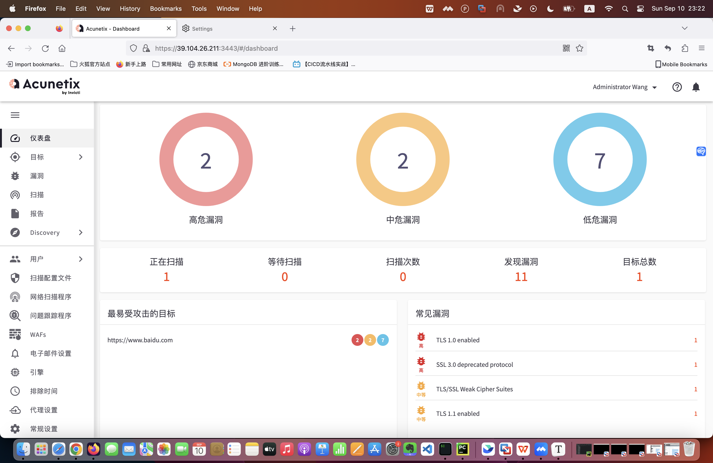
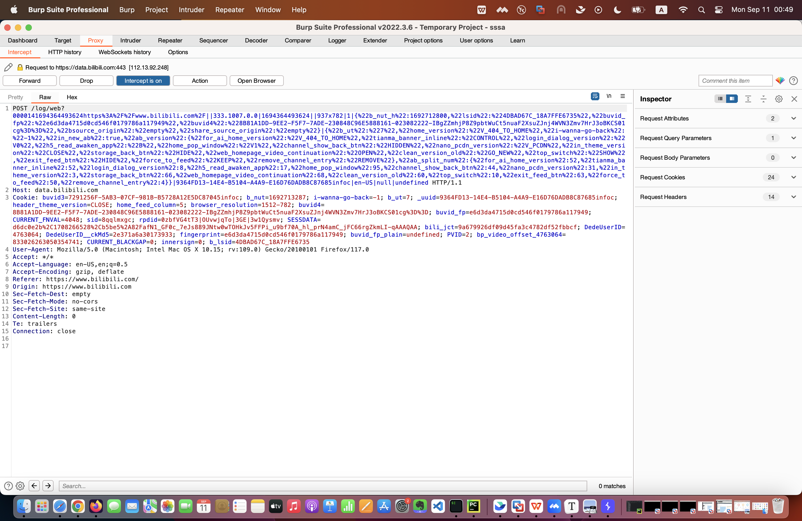

1. AWVS扫描www.baidu.com 是主动扫描模式




Xray（被动扫描模式）去扫描www.baidu.com 会加载xray默认poc，使用代理模式扫描网站，点击的时候才开始扫描。

```shell

➜ xray ./xray_darwin_arm64 webscan --listen 127.0.0.1:7777 --html-output xray-testbaidu.html

____  ___.________.    ____.   _____.___.
\   \/  /\_   __   \  /  _  \  \__  |   |
 \     /  |    _  _/ /  /_\  \  /   |   |
 /     \  |    |   \/    |    \ \____   |
\___/\  \ |____|   /\____|_   / / _____/
      \_/       \_/        \_/  \/

Version: 1.9.11/eb0c331d/COMMUNITY

[INFO] 2023-09-10 23:14:06 [default:entry.go:226] Loading config file from config.yaml
[WARN] 2023-09-10 23:14:06 [default:webscan.go:287] disable these plugins as that's not an advanced version, [shiro fastjson struts thinkphp]

Enabled plugins: [xstream dirscan path-traversal phantasm ssrf xss xxe baseline cmd-injection crlf-injection sqldet redirect brute-force jsonp upload]

[INFO] 2023-09-10 23:14:06 [phantasm:phantasm.go:185] 819 pocs have been loaded (debug level will show more details)
These plugins will be disabled as reverse server is not configured, check out the reference to fix this error.
Ref: https://docs.xray.cool/#/configration/reverse
Plugins:
	poc-go-apache-log4j2-rce
	poc-go-weblogic-cve-2023-21839
	poc-yaml-apache-druid-kafka-rce
	poc-yaml-apache-spark-rce-cve-2022-33891
	poc-yaml-dlink-cve-2019-16920-rce
	poc-yaml-dotnetnuke-cve-2017-0929-ssrf
	poc-yaml-drawio-cve-2022-1713-ssrf
	poc-yaml-full-read-ssrf-in-spring-cloud-netflix
	poc-yaml-ghostscript-cve-2018-19475-rce
	poc-yaml-gitlab-cve-2021-22214-ssrf
	poc-yaml-httpd-ssrf-cve-2021-40438
	poc-yaml-jenkins-cve-2018-1000600
	poc-yaml-jira-cve-2019-11581
	poc-yaml-jira-ssrf-cve-2019-8451
	poc-yaml-keycloak-cve-2020-10770-ssrf
	poc-yaml-kibana-cve-2019-7609-rce
	poc-yaml-landray-oa-datajson-rce
	poc-yaml-lg-n1a1-nas-cnnvd-201607-467-rce
	poc-yaml-mongo-express-cve-2019-10758
	poc-yaml-oracle-ebs-cve-2018-3167-ssrf
	poc-yaml-pandorafms-cve-2019-20224-rce
	poc-yaml-php-imap-cve-2018-19518-rce
	poc-yaml-ruanhong-oa-xxe
	poc-yaml-saltstack-cve-2020-16846
	poc-yaml-solr-cve-2017-12629-xxe
	poc-yaml-spiderflow-save-remote-command-execute
	poc-yaml-spring-cloud-gateway-cve-2022-22947-rce
	poc-yaml-supervisord-cve-2017-11610
	poc-yaml-wavlink-cve-2020-13117-rce
	poc-yaml-weblogic-cve-2017-10271
	poc-yaml-yongyou-nc-iupdateservice-xxe
	poc-yaml-zoho-manageengine-adaudit-plus-cve-2022-28219-xxe
	ssrf/ssrf/default
	xstream/Arbitrary-File-Deletion/CVE-2020-26259
	xstream/Arbitrary-File-Deletion/CVE-2021-21343
	xstream/DoS/CVE-2021-21341
	xstream/DoS/CVE-2021-21348
	xstream/DoS/CVE-2021-39140
	xstream/RCE(LDAP)/CVE-2021-21344
	xstream/RCE(LDAP)/CVE-2021-39141
	xstream/RCE(LDAP)/CVE-2021-39146
	xstream/RCE/CVE-2013-7285
	xstream/RCE/CVE-2020-26217
	xstream/RCE/CVE-2021-21345
	xstream/RCE/CVE-2021-21346
	xstream/RCE/CVE-2021-21347
	xstream/RCE/CVE-2021-21350
	xstream/RCE/CVE-2021-21351
	xstream/RCE/CVE-2021-39139
	xstream/RCE/CVE-2021-39144
	xstream/RCE/CVE-2021-39145
	xstream/RCE/CVE-2021-39147
	xstream/RCE/CVE-2021-39148
	xstream/RCE/CVE-2021-39149
	xstream/RCE/CVE-2021-39151
	xstream/RCE/CVE-2021-39153
	xstream/RCE/CVE-2021-39154
	xstream/SSRF/CVE-2020-26258
	xstream/SSRF/CVE-2021-21342
	xstream/SSRF/CVE-2021-21349
	xstream/SSRF/CVE-2021-39150
	xstream/SSRF/CVE-2021-39152
	xxe/xxe/blind


[INFO] 2023-09-10 23:14:06 [collector:mitm.go:215] loading cert from ./ca.crt and ./ca.key
[INFO] 2023-09-10 23:14:07 [collector:mitm.go:271] starting mitm server at 127.0.0.1:7777
[INFO] 2023-09-10 23:15:27 [default:dispatcher.go:444] processing GET https://39.104.26.211:3443/api/v1/me/stats
[*] All pending requests have been scanned
[*] scanned: 1, pending: 0, requestSent: 50, latency: 38.32ms, failedRatio: 0.00%
[INFO] 2023-09-10 23:15:37 [default:dispatcher.go:444] processing POST https://o1069899.ingest.sentry.io/api/6249939/envelope/?sentry_key=caa51ba7ccc74712a62dadc11a809e6a&sentry_version=7&sentry_client=sentry.javascript.react%2F7.46.0
[WARN] 2023-09-10 23:15:39 [sqldet:detector.go:239] different response status code 400/200
[INFO] 2023-09-10 23:15:41 [default:dispatcher.go:444] processing GET https://39.104.26.211:3443/api/v1/notifications
[*] scanned: 1, pending: 2, requestSent: 238, latency: 112.91ms, failedRatio: 0.00%
[*] scanned: 2, pending: 1, requestSent: 354, latency: 116.34ms, failedRatio: 0.00%
[WARN] 2023-09-10 23:15:48 [sqldet:detector.go:239] different response status code 400/200
[*] scanned: 2, pending: 1, requestSent: 394, latency: 121.94ms, failedRatio: 0.00%
[WARN] 2023-09-10 23:15:52 [sqldet:detector.go:239] different response status code 401/200
[INFO] 2023-09-10 23:15:55 [default:dispatcher.go:444] processing GET https://www.baidu.com/index.php?tn=monline_3_dg
[INFO] 2023-09-10 23:15:55 [default:dispatcher.go:444] processing POST https://incoming.telemetry.mozilla.org/submit/activity-stream/events/1/04f74a69-526d-4cb3-b1be-42c737493536
[INFO] 2023-09-10 23:15:56 [default:dispatcher.go:444] processing POST https://incoming.telemetry.mozilla.org/submit/activity-stream/impression-stats/1/0938b5b1-fdeb-4d22-80c9-cd396a647d7e
[ERRO] 2023-09-10 23:15:56 [controller:runner.go:86] dirscan/directory/backupGet "https://www.baidu.com/cmherstpak": EOF
[*] scanned: 2, pending: 9, requestSent: 535, latency: 119.54ms, failedRatio: 0.37%
[INFO] 2023-09-10 23:15:57 [default:dispatcher.go:444] processing POST https://incoming.telemetry.mozilla.org/submit/activity-stream/sessions/1/b829e6ac-5058-420b-a680-efd1ea7cb29a
[ERRO] 2023-09-10 23:15:58 [controller:runner.go:86] dirscan/directory/filesGet "https://www.baidu.com/gcwtrqgpgf": EOF
[ERRO] 2023-09-10 23:15:58 [controller:runner.go:86] dirscan/directory/helpGet "https://www.baidu.com/fxlcpvdrer": EOF
[ERRO] 2023-09-10 23:15:59 [controller:runner.go:86] dirscan/directory/sourceGet "https://www.baidu.com/iigtcfzcho": EOF
[ERRO] 2023-09-10 23:15:59 [controller:runner.go:86] dirscan/directory/defaultGet "https://www.baidu.com/acztyfrgle": EOF
[ERRO] 2023-09-10 23:15:59 [controller:runner.go:86] dirscan/directory/logsGet "https://www.baidu.com/xhgsncpaok": EOF
[INFO] 2023-09-10 23:16:00 [default:dispatcher.go:444] processing GET https://www.baidu.com/sugrec?&prod=pc_his&from=pc_web&json=1&sid=&hisdata=%5B%7B%22time%22%3A1692714787%2C%22kw%22%3A%22%E6%A2%A6%E7%8E%8B%E5%9B%BD%E4%B8%8E%E6%B2%89%E7%9D%A1%22%2C%22fq%22%3A2%7D%2C%7B%22time%22%3A1692714824%2C%22kw%22%3A%22%E5%A5%BD%E7%8E%A9%E7%9A%84%E4%B9%99%E5%A5%B3%E6%B8%B8%E6%88%8F%22%2C%22fq%22%3A2%7D%2C%7B%22time%22%3A1692791854%2C%22kw%22%3A%22aws%E4%BC%9A%E8%AE%AE2023%22%7D%2C%7B%22time%22%3A1692792286%2C%22kw%22%3A%22%E6%98%8E%E5%8A%A0%E7%A9%BA%E5%BF%B5%E4%BB%80%E4%B9%88%E5%AD%97%22%7D%2C%7B%22time%22%3A1692793721%2C%22kw%22%3A%22%E5%90%89%E6%9E%97%22%7D%2C%7B%22time%22%3A1692793744%2C%22kw%22%3A%22%E5%93%94%E5%93%A9%E5%93%94%E5%93%A9%22%7D%2C%7B%22time%22%3A1692956439%2C%22kw%22%3A%22hub.docker.com%E6%89%93%E4%B8%8D%E5%BC%80%22%2C%22fq%22%3A2%7D%2C%7B%22time%22%3A1693387187%2C%22kw%22%3A%22%E8%B5%A4%E5%8A%A0%E9%98%9D%E8%AF%BB%E4%BB%80%E4%B9%88%22%2C%22fq%22%3A2%7D%5D&_t=1694358955739&csor=0
[*] scanned: 2, pending: 9, requestSent: 1146, latency: 153.54ms, failedRatio: 0.61%
[INFO] 2023-09-10 23:16:02 [default:dispatcher.go:444] processing POST https://incoming.telemetry.mozilla.org/submit/firefox-desktop/newtab/1/b8d5aa08-0018-4f14-964d-cf77df64034b
[INFO] 2023-09-10 23:16:04 [default:dispatcher.go:444] processing POST https://incoming.telemetry.mozilla.org/submit/activity-stream/impression-stats/1/6e375e0d-806d-4029-bb17-cbb5b406cb88
[*] scanned: 2, pending: 9, requestSent: 2030, latency: 150.71ms, failedRatio: 0.34%
[INFO] 2023-09-10 23:16:08 [default:dispatcher.go:444] processing GET https://sp3.baidu.com/-0U_dTmfKgQFm2e88IuM_a/ps_fp.htm?pid=superman&fp=undefined&im=undefined&wf=undefined&br=3&qid=0x8e4965dc00249915&bi=9926F77AB071E9C15B22AD2A6C6C5F2B:FG=1
[*] scanned: 3, pending: 8, requestSent: 2673, latency: 169.89ms, failedRatio: 0.26%
[INFO] 2023-09-10 23:16:13 script poc-yaml-alibaba-nacos-v1-auth-bypass run payload hasPrefix
[INFO] 2023-09-10 23:16:13 script poc-yaml-alibaba-nacos-v1-auth-bypass run payload nonePrefix
[*] scanned: 3, pending: 8, requestSent: 3504, latency: 168.64ms, failedRatio: 0.20%
[INFO] 2023-09-10 23:16:21 script poc-yaml-wanhu-ezoffice-documentedit-sqli run payload oracle
[INFO] 2023-09-10 23:16:21 script poc-yaml-wanhu-ezoffice-documentedit-sqli run payload mysql
[INFO] 2023-09-10 23:16:21 script poc-yaml-wanhu-ezoffice-documentedit-sqli run payload mssql
[INFO] 2023-09-10 23:16:21 script poc-yaml-bitbucket-unauth run payload path01
[INFO] 2023-09-10 23:16:22 script poc-yaml-bitbucket-unauth run payload path02
[*] scanned: 3, pending: 8, requestSent: 4411, latency: 162.96ms, failedRatio: 0.16%
[INFO] 2023-09-10 23:16:22 script poc-yaml-bitbucket-unauth run payload path03
[INFO] 2023-09-10 23:16:22 script poc-yaml-bitbucket-unauth run payload path04
[INFO] 2023-09-10 23:16:22 script poc-yaml-bitbucket-unauth run payload path05
[INFO] 2023-09-10 23:16:22 script poc-yaml-bitbucket-unauth run payload path06
[INFO] 2023-09-10 23:16:22 script poc-yaml-bitbucket-unauth run payload path07
[INFO] 2023-09-10 23:16:22 script poc-yaml-bitbucket-unauth run payload path08
[INFO] 2023-09-10 23:16:22 script poc-yaml-php-proxy-cve-2018-19458-fileread run payload linux
[INFO] 2023-09-10 23:16:22 script poc-yaml-alibaba-nacos-v1-auth-bypass run payload hasPrefix
[INFO] 2023-09-10 23:16:22 script poc-yaml-alibaba-nacos-v1-auth-bypass run payload nonePrefix
[INFO] 2023-09-10 23:16:22 script poc-yaml-php-proxy-cve-2018-19458-fileread run payload win
[INFO] 2023-09-10 23:16:23 script poc-yaml-laravel-filemanager-cve-2022-40734-path-traversal run payload req01
[INFO] 2023-09-10 23:16:23 script poc-yaml-laravel-filemanager-cve-2022-40734-path-traversal run payload req02
[INFO] 2023-09-10 23:16:23 script poc-yaml-wanhu-ezoffice-documentedit-sqli run payload oracle
[INFO] 2023-09-10 23:16:23 script poc-yaml-wanhu-ezoffice-documentedit-sqli run payload mysql
[INFO] 2023-09-10 23:16:23 script poc-yaml-wanhu-ezoffice-documentedit-sqli run payload mssql
[INFO] 2023-09-10 23:16:24 script poc-yaml-adobe-experience-manager-cve-2019-8086-xxe run payload linux
[INFO] 2023-09-10 23:16:24 script poc-yaml-bitbucket-unauth run payload path01
[INFO] 2023-09-10 23:16:24 script poc-yaml-adobe-experience-manager-cve-2019-8086-xxe run payload win
[INFO] 2023-09-10 23:16:24 script poc-yaml-bitbucket-unauth run payload path02
[INFO] 2023-09-10 23:16:24 script poc-yaml-bitbucket-unauth run payload path03
[INFO] 2023-09-10 23:16:24 script poc-yaml-bitbucket-unauth run payload path04
[INFO] 2023-09-10 23:16:24 script poc-yaml-bitbucket-unauth run payload path05
[INFO] 2023-09-10 23:16:24 script poc-yaml-bitbucket-unauth run payload path06
[INFO] 2023-09-10 23:16:24 script poc-yaml-pbootcms-rce-cve-2022-32417 run payload linux
[INFO] 2023-09-10 23:16:24 script poc-yaml-bitbucket-unauth run payload path07
[INFO] 2023-09-10 23:16:24 script poc-yaml-bitbucket-unauth run payload path08
[INFO] 2023-09-10 23:16:24 script poc-yaml-pbootcms-rce-cve-2022-32417 run payload windows
[INFO] 2023-09-10 23:16:24 script poc-yaml-php-proxy-cve-2018-19458-fileread run payload linux
[INFO] 2023-09-10 23:16:24 script poc-yaml-php-proxy-cve-2018-19458-fileread run payload win
[INFO] 2023-09-10 23:16:25 script poc-yaml-laravel-filemanager-cve-2022-40734-path-traversal run payload req01
[INFO] 2023-09-10 23:16:25 script poc-yaml-laravel-filemanager-cve-2022-40734-path-traversal run payload req02
[INFO] 2023-09-10 23:16:25 script poc-yaml-adobe-experience-manager-cve-2019-8086-xxe run payload linux
[INFO] 2023-09-10 23:16:25 script poc-yaml-circarlife-scada-cve-2018-12634-info-leak run payload req01
[INFO] 2023-09-10 23:16:25 script poc-yaml-adobe-experience-manager-cve-2019-8086-xxe run payload win
[INFO] 2023-09-10 23:16:25 script poc-yaml-circarlife-scada-cve-2018-12634-info-leak run payload req02
[INFO] 2023-09-10 23:16:26 script poc-yaml-pbootcms-rce-cve-2022-32417 run payload linux
[INFO] 2023-09-10 23:16:26 script poc-yaml-pbootcms-rce-cve-2022-32417 run payload windows
[*] scanned: 3, pending: 8, requestSent: 5552, latency: 152.07ms, failedRatio: 0.13%
[INFO] 2023-09-10 23:16:27 script poc-yaml-glpi-telemetry-cve-2021-39211-info-leak run payload req01
[INFO] 2023-09-10 23:16:27 script poc-yaml-glpi-telemetry-cve-2021-39211-info-leak run payload req02
[INFO] 2023-09-10 23:16:27 script poc-yaml-circarlife-scada-cve-2018-12634-info-leak run payload req01
[INFO] 2023-09-10 23:16:27 script poc-yaml-circarlife-scada-cve-2018-12634-info-leak run payload req02
[INFO] 2023-09-10 23:16:28 script poc-yaml-gurock-testrail-cve-2021-40875-info-leak run payload req01
[INFO] 2023-09-10 23:16:28 script poc-yaml-gurock-testrail-cve-2021-40875-info-leak run payload req02
[INFO] 2023-09-10 23:16:29 script poc-yaml-mantisbt-cve-2017-7615-unauth run payload req01
[INFO] 2023-09-10 23:16:29 script poc-yaml-mantisbt-cve-2017-7615-unauth run payload req02
[INFO] 2023-09-10 23:16:29 script poc-yaml-mantisbt-cve-2017-7615-unauth run payload req03
[INFO] 2023-09-10 23:16:29 script poc-yaml-glpi-telemetry-cve-2021-39211-info-leak run payload req01
[INFO] 2023-09-10 23:16:29 script poc-yaml-mantisbt-cve-2017-7615-unauth run payload req04
[INFO] 2023-09-10 23:16:29 script poc-yaml-glpi-telemetry-cve-2021-39211-info-leak run payload req02
[INFO] 2023-09-10 23:16:29 script poc-yaml-mantisbt-cve-2017-7615-unauth run payload req05
[INFO] 2023-09-10 23:16:29 script poc-yaml-manageengine-servicedesk-cve-2017-11512-lfi run payload windows
[INFO] 2023-09-10 23:16:29 script poc-yaml-manageengine-servicedesk-cve-2017-11512-lfi run payload linux
[INFO] 2023-09-10 23:16:29 script poc-yaml-kevinlab-bems-backdoor-cve-2021-37292 run payload p1
[INFO] 2023-09-10 23:16:29 script poc-yaml-kevinlab-bems-backdoor-cve-2021-37292 run payload p2
[INFO] 2023-09-10 23:16:30 script poc-yaml-gurock-testrail-cve-2021-40875-info-leak run payload req01
[INFO] 2023-09-10 23:16:30 script poc-yaml-gurock-testrail-cve-2021-40875-info-leak run payload req02
[INFO] 2023-09-10 23:16:30 script poc-yaml-mantisbt-cve-2017-7615-unauth run payload req01
[INFO] 2023-09-10 23:16:30 script poc-yaml-mantisbt-cve-2017-7615-unauth run payload req02
[INFO] 2023-09-10 23:16:30 script poc-yaml-mantisbt-cve-2017-7615-unauth run payload req03
[INFO] 2023-09-10 23:16:30 script poc-yaml-mantisbt-cve-2017-7615-unauth run payload req04
[INFO] 2023-09-10 23:16:30 script poc-yaml-manageengine-servicedesk-cve-2017-11512-lfi run payload windows
[INFO] 2023-09-10 23:16:30 script poc-yaml-mantisbt-cve-2017-7615-unauth run payload req05
[INFO] 2023-09-10 23:16:30 script poc-yaml-kevinlab-bems-backdoor-cve-2021-37292 run payload p1
[INFO] 2023-09-10 23:16:30 script poc-yaml-manageengine-servicedesk-cve-2017-11512-lfi run payload linux
[INFO] 2023-09-10 23:16:30 script poc-yaml-kevinlab-bems-backdoor-cve-2021-37292 run payload p2
[*] scanned: 4, pending: 7, requestSent: 6604, latency: 139.68ms, failedRatio: 0.11%
[*] scanned: 4, pending: 7, requestSent: 6856, latency: 142.39ms, failedRatio: 0.10%
[*] scanned: 5, pending: 6, requestSent: 7053, latency: 141.48ms, failedRatio: 0.10%
[*] scanned: 5, pending: 6, requestSent: 7209, latency: 142.05ms, failedRatio: 0.10%
[INFO] 2023-09-10 23:16:51 [default:dispatcher.go:444] processing GET https://firefox.settings.services.mozilla.com/v1/buckets/monitor/collections/changes/changeset?_expected=%221694357835202%22&_since=%221694336234371%22
[INFO] 2023-09-10 23:16:51 [default:dispatcher.go:444] processing GET https://firefox.settings.services.mozilla.com/v1/buckets/security-state/collections/cert-revocations/changeset?_expected=1694357835202&_since=%221694336234371%22
[*] scanned: 6, pending: 8, requestSent: 7415, latency: 147.23ms, failedRatio: 0.09%
[INFO] 2023-09-10 23:16:52 [default:dispatcher.go:444] processing GET https://content-signature-2.cdn.mozilla.net/chains/onecrl.content-signature.mozilla.org-2023-10-29-15-54-10.chain
[WARN] 2023-09-10 23:16:52 [sqldet:detector.go:239] different response status code 400/200
[WARN] 2023-09-10 23:16:53 [sqldet:detector.go:437] octet-stream binary/octet-stream/binary/octet-stream content type can not be compared
[WARN] 2023-09-10 23:16:53 [sqldet:detector.go:437] octet-stream binary/octet-stream/binary/octet-stream content type can not be compared
[*] scanned: 7, pending: 7, requestSent: 7736, latency: 185.71ms, failedRatio: 0.09%
[INFO] 2023-09-10 23:16:58 script poc-yaml-alibaba-nacos-v1-auth-bypass run payload hasPrefix
[INFO] 2023-09-10 23:16:58 script poc-yaml-alibaba-nacos-v1-auth-bypass run payload nonePrefix
[WARN] 2023-09-10 23:16:59 [sqldet:detector.go:239] different response status code 400/200
[INFO] 2023-09-10 23:16:59 script poc-yaml-wanhu-ezoffice-documentedit-sqli run payload oracle
[INFO] 2023-09-10 23:17:00 script poc-yaml-bitbucket-unauth run payload path01
[INFO] 2023-09-10 23:17:00 script poc-yaml-wanhu-ezoffice-documentedit-sqli run payload mysql
[INFO] 2023-09-10 23:17:01 script poc-yaml-bitbucket-unauth run payload path02
[INFO] 2023-09-10 23:17:01 script poc-yaml-bitbucket-unauth run payload path03
[INFO] 2023-09-10 23:17:01 script poc-yaml-php-proxy-cve-2018-19458-fileread run payload linux
[INFO] 2023-09-10 23:17:01 script poc-yaml-wanhu-ezoffice-documentedit-sqli run payload mssql
[INFO] 2023-09-10 23:17:01 script poc-yaml-bitbucket-unauth run payload path04
[INFO] 2023-09-10 23:17:01 script poc-yaml-php-proxy-cve-2018-19458-fileread run payload win
[INFO] 2023-09-10 23:17:01 script poc-yaml-bitbucket-unauth run payload path05
[INFO] 2023-09-10 23:17:01 script poc-yaml-bitbucket-unauth run payload path06
[*] scanned: 8, pending: 6, requestSent: 8140, latency: 285.53ms, failedRatio: 0.09%
[INFO] 2023-09-10 23:17:02 script poc-yaml-laravel-filemanager-cve-2022-40734-path-traversal run payload req01
[INFO] 2023-09-10 23:17:02 script poc-yaml-bitbucket-unauth run payload path07
[INFO] 2023-09-10 23:17:02 script poc-yaml-laravel-filemanager-cve-2022-40734-path-traversal run payload req02
[INFO] 2023-09-10 23:17:02 script poc-yaml-bitbucket-unauth run payload path08
[INFO] 2023-09-10 23:17:03 script poc-yaml-adobe-experience-manager-cve-2019-8086-xxe run payload linux
[INFO] 2023-09-10 23:17:03 script poc-yaml-pbootcms-rce-cve-2022-32417 run payload linux
[INFO] 2023-09-10 23:17:03 script poc-yaml-adobe-experience-manager-cve-2019-8086-xxe run payload win
[INFO] 2023-09-10 23:17:03 script poc-yaml-pbootcms-rce-cve-2022-32417 run payload windows
[INFO] 2023-09-10 23:17:05 script poc-yaml-circarlife-scada-cve-2018-12634-info-leak run payload req01
[INFO] 2023-09-10 23:17:05 script poc-yaml-circarlife-scada-cve-2018-12634-info-leak run payload req02
[*] scanned: 10, pending: 4, requestSent: 8553, latency: 307.92ms, failedRatio: 0.08%
[INFO] 2023-09-10 23:17:07 script poc-yaml-glpi-telemetry-cve-2021-39211-info-leak run payload req01
[INFO] 2023-09-10 23:17:07 script poc-yaml-glpi-telemetry-cve-2021-39211-info-leak run payload req02
[INFO] 2023-09-10 23:17:08 script poc-yaml-gurock-testrail-cve-2021-40875-info-leak run payload req01
[INFO] 2023-09-10 23:17:09 script poc-yaml-mantisbt-cve-2017-7615-unauth run payload req01
```


2. 使用 Nessus 扫描任一主机，要求使用全端口扫描，提供主机扫描报告； 报告名为 remote-ecs-scan_jdrgcp.html
3. 安装 Burp，分别在本机上实现全局代理和局部代理，提供设置过程的说明文档；

全局代理：打开Safari--> Settings--> Advanced--> Proxies --> Change Settings... --> enable "Web Proxy(HTTP)" and "Secure Web Proxy(HTTPS)" --> Server: 127.0.0.1, Port: 8080 --> Save 

firefox浏览器局部代理：Open application menu --> Settings--> General --> Network Settings --> Settings --> select "Manual proxy configuration" --> HTTP Proxy 127.0.0.1 , Port 8080 , also select "Also use this proxy for HTTPS"

firefox可以安装proxy 插件firefox proxy，来更便捷的开启关闭及切换代理。


4. 利用 Burp 实现对 HTTPS 站点的抓包。

   
