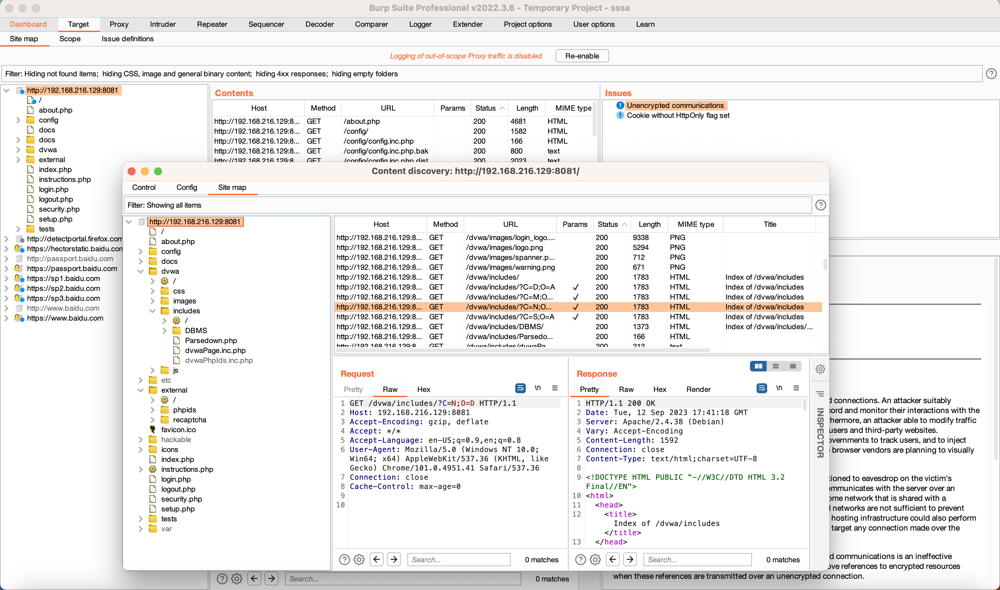
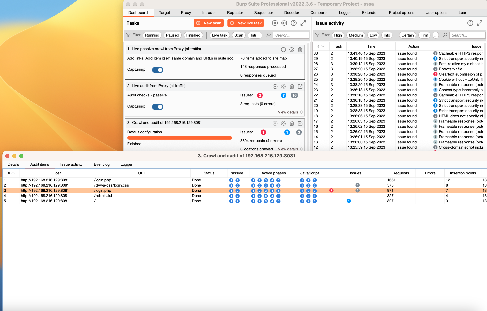
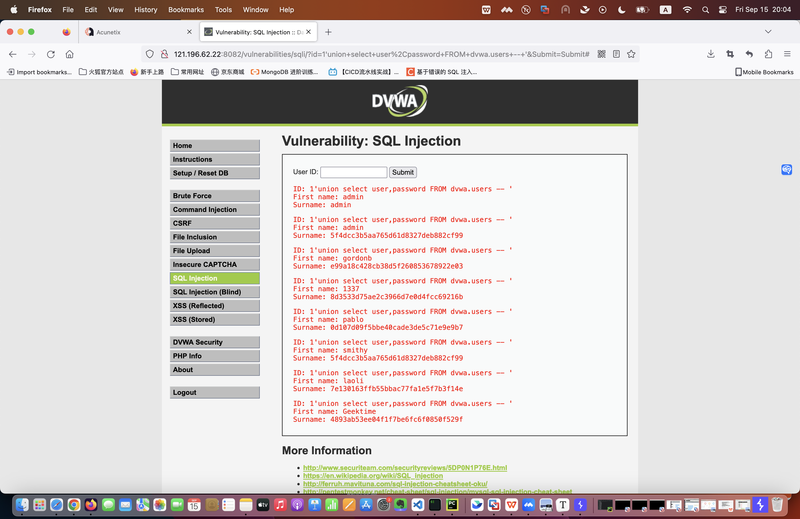
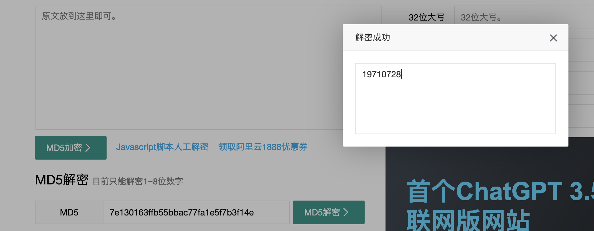
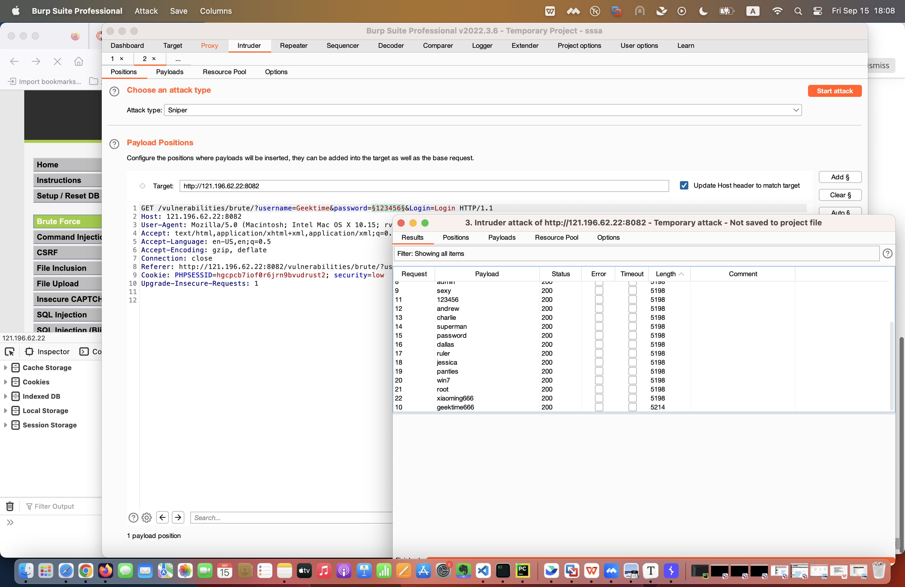

1. 使用 Burp 的 Discover Content 功能爬取任意站点的目录，给出爬取过程的说明文档、站点树截图；

    1）配置好firefox代理后，使用Burp 的Proxy-Intercept去拦截DVWA站点http://192.168.216.129:8081/ 

    2）在Target-Site map中可以看到DVWA的url，选中此url右键点击Engagement tools-Discover content进入discover content窗口

    3）在control tab下点击session is not running开始爬取站点目录，默认爬取文件和目录，爬取目录层级最多16层。

    4）点击session is running 停止爬取。在site map 下查看爬取的目录树。

 - 

2. 分别使用 Burp Scan 的主动扫描和被动扫描功能对 DVWA 站点进行扫描，输出扫描报告；

 - 

 - 导出报告文件为 [dvwa-report.html](./dvwa-report.html) 

3. Burp Intruder 爆破题目

靶场地址：[ http://121.196.62.22:8082/vulnerabilities/brute/](http://121.196.62.22:8082/vulnerabilities/brute/)

靶场开放时间：2023.9.9 ~ 2023.9.24

管理员账号 / 密码：admin/password

注意事项：爆破成功的同学请勿修改任何账号的密码，以免影响其他同学正常作业。

- 老李今年 52 岁了，他最近也在学习网络安全，为了方便练习，他在 DVWA 靶场中增设了一个自己的账号，密码就是他的生日，请你想办法破解出他的账号密码。

​		"SELECT first_name, last_name FROM users WHERE user_id = '$id';"; 

 - 

	账号：laoli

	密码：19710728

- Cookie 老师在 DVWA 靶场中设置了一个账号 Geektime（注意首字母大写），且在靶场中的某处存放了一个文件名为 geekbang.txt 的密码字典，请你想办法找到该字典并尝试爆破，最终获取到账号 Geektime 的正确密码。

  	账号：Geektime

  	密码：geektime666

  - 

4. 在不依赖于 DVWA 后端数据库的情况，如何通过前端验证的方法判断 DVWA 中的注入点是数字型注入还是字符型注入？（提示：用假设法进行逻辑判断）

   1) 假设是数字型注入，在Vulnerability: SQL Injection 中的 User ID: 1 提交，返回admin正常值，所以暂时判断是数字型注入

   2) 继续输入 1 and 1=1，应该也是正常执行，输出一样的结果

   3) 继续在User ID中输入：1 and 1=2 ，如果是数字型注入，应该做逻辑判断，无法得出查询结果， 可页面结果仍然输出相同的结果。

   4) 假设是字符型注入，输入 1' and '1'='1# ，应该正常显示，结果无显示。所以不是字符型注入。

   5) 继续 输入 1' and '1'='2 # ，应该无法显示或页面报错， 结果仍是无显示。

   6) 查看dvwa页面源码，发现用户输入的内容，程序会自动加上单引号，所以可以通过以上判断 dvwa的注入点是数字型注入。
